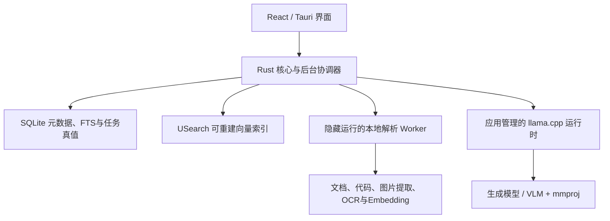

# 拾忆 V1 产品与开发规划书

> 主 Slogan：**拾起你被遗忘的记忆**
>
> 副 Slogan：**拾起散落的信息，连接过去的自己**

本规划书是拾忆 V1 的唯一需求源。真实实现状态、自动测试、运行时证据和发布边界统一维护在[拾忆 V1 方案逐条审查清单](V1-方案逐条审查清单.md)。不恢复或新建独立用户旅程目录。

## 一、产品定义与安全边界

拾忆是一款完全本地化、源文件只读的 AI 信息管理助手。它在用户明确授权的本地资料中建立可追溯知识库，帮助用户搜索、提问、发现资料关系并创建虚拟分类。

V1 核心能力：

1. 用户明确授权目录或整个本地磁盘；
2. 文档、代码、图片及文档内图片的结构化解析与索引；
3. 文件名、全文、向量语义和可选重排组成的混合检索；
4. 只依据原文证据回答的本地多模态 RAG；
5. 手动集合、关键词规则集合和 AI 智能集合；
6. 重复、版本和内容关系识别；
7. 收件箱、预览、维护、诊断及显式导出。

不可放宽的安全边界：

- 未经用户选择的目录不得读取或扫描；
- 应用不得移动、重命名、删除或覆盖源文件；
- 图片提取、旧格式转换、压缩包展开和索引只写入应用管理目录；
- 业务导出必须由用户显式触发，只能新建文件，目标存在时拒绝；
- 文件、索引、提问、回答和模型推理保持本地；只有用户主动下载模型时才访问锁定的模型来源；
- 前端和普通日志只显示授权根内的 `display_path`，不记录正文、问题或敏感绝对路径；
- 模型输出必须通过 Schema、权限、当前修订和来源证据校验。

## 二、本轮方案相对旧版的变化

| 范围 | 旧方案 | V1 当前方案 |
|---|---|---|
| 首次扫描 | 自动注册桌面、文档、下载和图片 | 首次必须由用户明确选择文件夹或整个磁盘，零授权即零扫描 |
| 最低配置 | 16GB 内存 | 8GB 内存、CPU 可运行；低配允许跨多次启动渐进处理 |
| 规模目标 | 2万文件、20万文本块 | 50万文件、500万内容块 |
| 向量检索 | SQLite BLOB 精确遍历 | SQLite保存真值，USearch保存可替换ANN索引 |
| 图片 | 独立图片OCR | 独立图片、内嵌图片、图表和扫描页均形成可定位图片资产并由多模态模型理解 |
| 模型配置 | 固定轻量版/标准版 | 生成、Embedding、多模态、Rerank按角色独立选择 |
| RAG | 文本证据问答 | 严格多模态证据问答、真实会话、图片证据和双重关键词高亮 |
| 集合 | 手动和简单规则 | 手动、可视化组合规则、AI虚拟分类建议及审核闭环 |
| 主题 | 单一浅色渐变 | 跟随系统、白天渐变、夜晚暗黑 |
| 资源状态 | 向用户显示full/balanced/core | 内部调度状态不公开，只展示可操作的任务提示 |

旧安装包、历史测试数量、文件大小和哈希只说明当时构建结果，不证明本规划已经实现。

## 三、运行环境与总体架构

- 首发平台：Windows 10/11 x64；
- 最低配置：8GB 内存、CPU、SSD；不设置硬件上限；
- 目标规模：50万文件、500万文本块或图片块；
- 默认断网运行，无遥测、云同步、后台模型更新或远程推理；
- 主程序使用 Tauri 2、React、TypeScript；核心使用 Rust；解析与模型辅助管道使用冻结的本地 Worker；
- 发布版为 Windows GUI 子系统，Worker始终隐藏启动；重复启动只聚焦已有窗口。



应用只维护一个全局物理知识库。目录、知识空间、手动集合、规则集合和 AI 集合只是逻辑范围，同一文件和修订不得因多个范围重复解析或保存。

## 四、原子任务、检查点和后台调度

所有长操作统一返回 `OperationHandle`，支持查询、暂停、继续和取消。每个原子单元必须声明输入、输出、前置条件、后置条件、超时、重试、幂等键、检查点和错误类型。

后台协调器按以下优先级分配资源：

1. 窗口消息、取消和用户操作；
2. 搜索、问答检索和原文预览；
3. 目录增量同步与轻量解析；
4. Embedding和图片理解；
5. OCR、复杂解析、AI集合和维护任务。

内部可以根据内存、CPU、队列、延迟和错误率调整并发或暂停低优先任务，但不得把 `full`、`balanced`、`core` 等内部名称暴露到公共契约、状态栏、设置页或日志页面。队列拥堵时只显示“后台处理队列较长，优先保证搜索和预览”等可理解、可操作的信息。

## 五、目录授权、扫描与存储

### 1. 首次授权

首次欢迎和环境检测后进入资料位置选择页。用户可以：

- 选择一个或多个普通文件夹；
- 选择整个本地固定磁盘；
- 暂不添加并进入空资料库。

系统可以发现桌面、文档、下载、图片、OneDrive、微信或QQ等候选位置，但只能作为建议展示，用户确认前不得注册、枚举或扫描。

整盘扫描必须二次确认，并强制排除 Windows、Program Files、ProgramData、AppData、系统卷信息、回收站、凭据、重解析点、云占位符、应用自身目录和其他受保护位置。硬排除不可关闭；开发依赖、构建缓存和临时文件作为用户可调整的默认排除。

根目录重叠时使用稳定文件身份和多对多成员关系，同一文件只建立一份当前修订。移动存储使用稳定卷标识恢复；设备离线时保留索引但明确标记不可用。

### 2. 存储与迁移

- SQLite保存目录授权、文件、修订、结构节点、文本块、图片资产、FTS、任务、会话、集合、关系、模型和索引世代；
- USearch按Embedding模型和索引世代保存向量ANN文件，损坏或缺失时可由SQLite真值重建；
- 默认应用数据目录可迁移到其他本地磁盘，但不得迁入任一授权源目录；
- 默认软配额为目标卷容量的10%，下限10GB、上限50GB，用户可调整；
- 配额不足时暂停图片缓存、OCR和Embedding，不删除已验证索引或模型，不影响搜索和预览；
- 初次索引和重建允许跨多次启动执行，从最后一个有效检查点继续。

### 3. 向量索引世代

`IndexGeneration`记录Embedding模型、维度、距离度量、USearch文件、覆盖率、校验结果和激活状态。切换Embedding模型时必须多次明确提示需要重建；旧索引继续服务，新世代在后台构建并验证，只有维度、自检、覆盖率和抽样召回全部通过后才原子激活。失败或取消保留旧索引。

## 六、内容处理与知识块

### 1. 文本和结构

文本按标题、段落、列表、表格、工作表、幻灯片、备注和代码符号切分。默认目标384 tokens、最大480、重叠64；不得跨越一级标题、工作表或幻灯片。每个块保留文件、修订、节点、语言和精确 `SourceLocator`。

支持策略：

- PDF、DOCX/DOCM、XLSX/XLSM、PPTX/PPTM：结构化只读解析；宏永不执行；
- DOC/XLS/PPT：通过可选离线兼容包转换应用缓存中的临时副本；
- TXT、Markdown、CSV、TSV、HTML：按结构和行号解析；
- 常见编程文件：按语言、符号、类、函数和连续代码区块解析；未知语言退回行范围切分；
- ZIP等压缩包：默认只索引文件清单，用户确认后才可展开到应用缓存；
- EXE、DLL、MSI：仅记录签名、版本、产品名、大小、哈希等安全元数据，永不加载或执行；
- 音视频：V1只记录元数据，不做转写或抽帧理解；
- 加密或损坏文件：标记状态并说明原因，不尝试绕过保护。

### 2. 图片资产

`ImageAsset`覆盖独立图片、PDF内嵌图片、Office内嵌图片、图表、扫描页和渲染区域。每个资产保存当前修订、内容哈希、来源类型、页码/幻灯片/形状/bbox、只读缓存引用、OCR文字、结构化多模态摘要、Embedding状态和模型版本。

图片处理顺序为：只读提取或渲染 → 哈希去重 → OCR → 多模态结构化理解 → Schema与来源校验 → 图片摘要分块 → Embedding → 原子提交。文件修订变化时只重建受影响的文本块和图片资产。

## 七、模型角色与资源管理

模型角色独立配置：

- `generation`：依据证据生成和润色回答；
- `embedding`：文本、文档画像和图片摘要向量；
- `vision`：理解图片、图表和扫描页；
- `reranker`：可选，对有限候选重新排序。

应用提供经过兼容性、许可、中文质量和资源基准验证的模型目录，并允许用户导入本地GGUF/ONNX及必要配套文件。候选基线为 BGE-small-zh-v1.5、Qwen3 1.7B、Qwen3-VL 2B和BGE Reranker；未通过8GB CPU与中文基准前不得标为默认推荐。

模型配置界面展示真实CPU、内存、GPU和显存，并给出推荐组合。超过设备建议的模型必须先显示预计内存、后端和速度风险，再执行最小加载与推理自检；失败时卸载并恢复原配置。8GB CPU设备串行运行图片理解和生成，不让二者同时常驻。

下载任务持久化阶段、组件、字节、总量、速度、ETA、来源、重试和错误。右上角持续显示活动任务；支持暂停、继续、取消、重试和切换来源。所有组件分别校验大小、SHA-256、格式和自检，完整配置通过后才原子激活。

## 八、严格本地多模态 RAG

### 1. 检索范围与会话

默认检索全部授权资料；用户可限定目录、知识空间或集合。V1问题输入为文本。会话和消息本地持久化，真实使用历史理解追问；历史只能帮助改写检索问题，不能作为事实证据。

### 2. 流水线

1. 将追问改写为独立检索问题；
2. 在授权范围并行执行文件名、FTS和USearch语义召回；
3. 使用RRF融合、修订去重和MMR控制重复；
4. 配置Rerank时对有限候选重排；
5. 选择最多12个内容块、8个文件和约6000 tokens证据；
6. 最终重排候选含图片时，使用当前问题重新调用多模态模型理解图片；没有Rerank时使用入库摘要，用户可主动“深度分析原图”；
7. 本地生成模型只能依据证据形成候选事实句；
8. 每句校验引用编号、目录授权、当前修订、原文片段和图片定位；
9. 只有验证通过的句子及引用可以流式显示。

无证据、引用错误、越权或修订过期时明确拒答。完整RAG不可用时展示缺失模型和索引覆盖率；用户明确选择后才能进入单独标识的“证据摘录模式”，不得静默退回规则答案。

### 3. 证据展示

- 回答中命中用户问题关键词的文字加粗；
- 原文片段同步高亮关键词；
- DOCX显示段落，Excel显示工作表与单元格，PPT显示幻灯片和形状，PDF显示页码和bbox；
- 图片证据显示缩略图、来源文件和位置，支持定位到原文；
- 高亮只用于展示，不改变引用原文或模型证据。

## 九、智能集合、规则和关系

集合分为 `manual`、`rule` 和 `ai`，均为应用内虚拟组织，不改变真实目录。

规则集合使用可视化条件树，支持文件名、正文、类型、路径、时间、大小，支持AND、OR、排除和命中预览。规则命中记录为 `source=rule`，人工添加或排除优先。

AI集合为每个当前修订生成文档画像，使用文档Embedding、正文相似、实体、时间线、图片语义和已有关系增量产生候选边与候选组，禁止对50万文件执行全量两两比较。本地模型只复核有限候选组并输出建议名称、说明、成员、置信度和逐成员理由。

建议先处于 `suggested`。用户可以改名、移除误判、补充成员、确认或拒绝；确认后原子创建虚拟集合。拒绝和人工排除形成抑制记录，除非文档修订、算法或模型版本变化，否则不重复推荐。

## 十、主题与交互

主题偏好：

- `system`：默认值，跟随Windows；浅色映射白天渐变，深色映射夜晚暗黑；系统状态不可用时回退白天渐变；
- `day_gradient`（白天渐变）：沿用雾蓝、浅紫、淡粉视觉和当前柔和动效；
- `night_dark`（夜晚暗黑）：黑色背景、白色正文，并为卡片、边框、引用、输入框、预览和高亮提供可读暗色变量。

用户手动覆盖后持久保存。欢迎页、标题栏、导航、弹窗、搜索、问答、集合、模型下载、PDF预览和空状态必须完整适配。Windows启用减少动态效果时关闭非必要位移、缩放、粒子和循环动画，但保留即时状态反馈。

首次流程：

```text
品牌欢迎 → 环境检测 → 用户选择资料位置或暂不添加 → 进入可交互首页
         → 可选配置模型 → 后台渐进扫描、解析与索引
```

## 十一、公共契约

所有ID使用UUIDv7，时间使用UTC RFC3339，跨语言字段使用`snake_case`，错误统一为`AppError`。

新增或调整：

- `ThemePreference`：`preference`、`effective_theme`、`updated_at`；
- `KnowledgeSpace`：逻辑范围及目录/集合成员，不复制文件；
- `ImageAsset`：图片来源、定位、缓存引用、OCR、摘要、模型与索引状态；
- `ContentChunk`：文本或图片摘要块、来源节点、定位和索引世代；
- `ModelRoleConfig`：生成、Embedding、多模态、Rerank角色与活跃组件；
- `IndexGeneration`：模型、维度、USearch文件、覆盖率、自检和激活状态；
- `RagReadiness`：角色就绪、当前范围覆盖率、可操作阻塞原因，不暴露内部资源模式；
- `AskSession`、`AskMessage`、`AnswerClaim`：真实多轮、证据和验证状态；
- `CollectionSuggestion`：建议成员、理由、置信度、算法/模型版本和审核状态；
- `OperationHandle`：阶段、进度、检查点、暂停、恢复、取消和结构化错误。

文件、集合成员、关系、日志、图片资产和建议接口均使用游标分页。前端公共契约不得出现 `full | balanced | core`。

## 十二、开发阶段

1. **需求与基线收口**：改写规划书、按真实代码重置审查清单、隐藏未完成入口；
2. **授权与存储**：首次选择目录、零授权零扫描、整盘硬排除、存储迁移、SQLite + USearch世代；
3. **内容与图片**：结构化分块、代码、内嵌图片、图表、扫描页、OCR、多模态摘要和可恢复索引；
4. **模型系统**：角色化配置、硬件推荐、下载进度、自检、低配调度和Embedding原子迁移；
5. **严格RAG**：混合召回、可选重排、图片再理解、真实会话、逐句引用、双重高亮；
6. **集合与关系**：可视化规则、AI建议、审核、抑制和增量更新；
7. **主题与功能收口**：两套主题、跟随系统、隐藏内部模式、未完成次要能力禁用；
8. **回归与交付**：合成压力库、真实安装、源文件哈希、安装包大小与SHA-256。

每阶段只在存在代码、自动测试和相称的运行时证据后更新为“已验证”。

## 十三、验收门禁

- 8GB CPU设备在扫描、Embedding、图片理解和问答期间窗口持续响应；
- 50万文件/500万块合成库通过分页、FTS、USearch、恢复和索引切换测试；
- 冷启动5秒内窗口可见，无控制台，重复启动只聚焦已有窗口；
- 首次未授权时文件发现数、文件读取数和扫描任务数均为零；
- 整盘硬排除、移动存储离线、数据库锁、磁盘不足和断电式恢复可控；
- PDF/PPT/Word内嵌图片、图表和扫描页能形成可定位图片证据；
- 多轮追问、跨文件综合、无证据拒答、越权引用拒绝和取消通过中文基准；
- 事实句引用覆盖率、越权引用拒绝率和确定性拒答案例均为100%；
- AI集合建议可解释、可确认/拒绝/排除，源文件位置和哈希不变；
- 白天渐变、夜晚暗黑、跟随系统、手动覆盖、重启记忆和减少动态效果通过视觉与交互测试；
- 所有页面和用户可见日志均不出现内部资源模式名称；
- Rust fmt、Clippy、workspace测试、Worker测试、TypeScript、Vitest、Vite、契约、语料、压力和安装烟测全部通过。

代码签名、独立干净Win10/11、杀软、多GPU和可移动设备矩阵属于正式发布门禁，未完成前不得宣称正式发布。

## 十四、暂不支持

- 云同步、NAS/网络共享持续监听、多人协作、移动端和插件市场；
- 任意Agent、自定义脚本、Shell或第三方软件自动操作；
- 音视频转写和抽帧理解；
- 未经用户确认的压缩包内容展开；
- 任何源文件自动整理、移动、改名、删除或覆盖。
