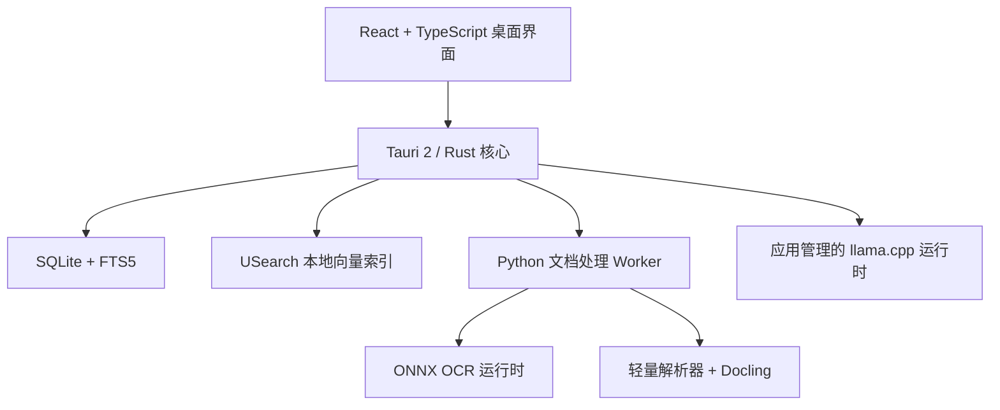

# 拾忆 V1 产品与开发规划书

> 主 Slogan：**拾起你被遗忘的记忆**
>
> 副 Slogan：**拾起散落的信息，连接过去的自己**

讨论进度与节点入口参见：[用户旅程讨论索引](用户旅程/00-讨论索引.md)。

## 一、产品定义

### 1. 品牌

- 产品名：**拾忆**
- 主 Slogan：**拾起你被遗忘的记忆**
- 副 Slogan：**拾起散落的信息，连接过去的自己**
- 一句话介绍：**拾忆是一款完全本地化的 AI 信息管理助手，它帮助你理解、整理和找回电脑中散落的资料，让每一份被遗忘的信息重新产生价值。**
- 当前界面与左上角品牌组合标以[拾忆 V1 界面视觉基准](设计/拾忆-V1-界面视觉基准.md)为实现依据。

### 2. 产品理念

人的大脑会遗忘，但数字世界保存了大量过去的痕迹。

拾忆通过本地 AI 理解你的文件、资料和知识，在保护隐私的同时，帮助你重新发现过去积累的信息。

“拾起”意味着主动发现、整理和找回；“遗忘的记忆”是用户曾经拥有但已经找不到的信息；“散落的信息”是分布在电脑各处的文件、资料和记录；“连接过去的自己”则意味着让过去积累的知识继续产生价值。

### 3. 首页文案

> 拾忆<br>
> 拾起你被遗忘的记忆
>
> 你的文件、资料和知识，<br>
> 一直都在那里。
>
> 只是需要一个方式，<br>
> 重新找到它们。

### 4. V1 产品边界

V1 同时覆盖七类能力：

1. 本地统一搜索
2. 自动信息收件箱
3. 智能集合
4. 可追溯知识问答
5. 结构化信息抽取
6. 重复、版本和相关文件识别
7. 批量分析与文件整理建议

“整理”仅表示虚拟分类、关系发现和操作建议。拾忆不得移动、重命名、删除或覆盖源文件。

允许的唯一业务写入是：用户主动选择路径后，新建 XLSX、CSV、JSON、DOCX 等导出文件；目标文件已存在时必须停止，不允许覆盖。

---

## 二、确定的技术方案

### 1. 运行环境

- 首发平台：Windows 10/11 x64
- 最低配置：16GB 内存、CPU 可完整运行、SSD
- 目标规模：20,000 个文件、约 200,000 个文本块、100GB 原始资料
- 网络策略：默认不联网且不包含遥测或云同步；仅在用户主动选择联网下载模型或手动检查模型更新后，访问魔搭社区或 Hugging Face
- 交付方式：主程序以Windows x64简体中文NSIS `.exe`安装程序交付，内含独立文档处理Worker与WebView2离线安装器；旧Office兼容包与模型分开提供。模型可由用户导入常见格式本地文件，也可经明确确认后联网下载

### 2. 系统架构



- 桌面端：Tauri 2、React、TypeScript、Vite、Ant Design、Zustand、TanStack Query、TanStack Virtual、PDF.js。
- Rust 核心：授权目录、文件监听、哈希、SQLite、任务状态机、向量索引、模型进程、只读权限和导出。
- Python 3.12 Worker：文档解析、OCR、分块、Embedding、抽取规则和提示词管道。
- Tauri 前端不直接访问文件系统；所有调用经过 Rust 命令和授权检查。Tauri 2 的 Capability/Permission 用于限制 WebView 可调用的系统能力。[Tauri 权限机制](https://v2.tauri.app/security/capabilities/)
- 全文检索使用 SQLite FTS5；中文正文在写入前统一分词。[SQLite FTS5](https://www.sqlite.org/fts5.html)
- 向量索引使用 Rust 内嵌 USearch、Cosine、BF16和磁盘快照，避免 Docker 和额外数据库服务；向量维度由已验证的共享 Embedding 配置记录，不提前写死。[USearch Rust SDK](https://unum-cloud.github.io/USearch/rust/index.html)
- 轻量版与标准版使用不同的 GGUF 生成模型，共享同一个中文 Embedding 与 OCR 组件；标准版可增加重排模型，切换生成模型不触发索引重建。
- 对话生成使用 GGUF 与应用管理的 `llama.cpp` 运行时；Embedding、重排和 OCR 使用 GGUF 或 ONNX 与对应本地运行时。具体模型、量化、维度和资源阈值由性能评测后固定版本。
- V1 不检测、不连接、不下载或运行 Ollama，也不执行模型目录中的脚本或远程自定义代码。
- 模型只允许从用户明确选择的本地文件导入，或在用户确认后从魔搭社区、Hugging Face下载；所有推理仍在本地完成。

代码分为三个主要工作区：

- `apps/desktop`：React 与 Tauri 桌面应用
- `crates/core`：Rust 领域模型、存储、检索和任务引擎
- `services/worker`：Python 解析、OCR、Embedding 与 AI 管道

### 3. 工程设计原则

#### 3.1 原子化设计

各项能力必须拆分为尽可能独立的最小可执行单元。每个单元功能单一、接口清晰，并可以单独运行、单独验证和单独重试。

统一的 `ExecutionUnit` 契约：

```text
unit_id: string
unit_type: string
input_schema: string
output_schema: string
inputs: object
preconditions: CheckRule[]
postconditions: CheckRule[]
timeout_ms: integer
retry_policy: RetryPolicy
idempotency_key: string
risk_level: low | medium | high
checkpoint_policy: always | on_success | none
fallback_unit_types: string[]
```

约束：

- 单元之间只通过显式 Schema 传递数据，不依赖隐式共享状态；
- 单元产生的结果在验证通过前不可供下游使用；
- 一个单元失败只影响当前分支，不回滚或污染已验证结果；
- 解析一页、生成一批 Embedding、校验一个字段、融合一组搜索候选都应成为可恢复单元；
- 文件授权、导出确认等安全边界不能被拆散或绕过。

#### 3.2 渐进验证机制

关键步骤之间设置自动检查站。每个单元完成后立即检查，不等整个任务结束才集中验证。

`ValidationCheckpoint`：

```text
checkpoint_id: string
job_id: string
unit_id: string
checkpoint_type: schema | invariant | evidence | permission | resource | quality
status: passed | failed | warning
rules_version: string
metrics: object
error: AppError | null
created_at: datetime
resume_token: string | null
```

每个检查站至少评估：

- 输入输出是否满足 Schema；
- 必填字段、页码、单元格和引用是否完整；
- 来源文件、目录授权和只读状态是否仍然有效；
- 结果是否达到当前任务的最低质量阈值；
- 内存、CPU、耗时和队列长度是否仍在预算内。

检查失败时只重试、替换或降级当前单元；任务从最后一个 `passed` 检查点恢复。

#### 3.3 多路径探索

仅对不确定性高、单一路径容易失败的任务并行或顺序生成 2—3 个候选路径。确定性操作不强制多路径，避免无意义地增加资源消耗。

`ExplorationCandidate`：

```text
candidate_id: string
job_id: string
strategy: string
status: pending | running | valid | rejected | selected
result_ref: string | null
quality_score: number | null
evidence_score: number | null
latency_ms: integer | null
resource_cost: number | null
rejection_reasons: string[]
```

首版适用场景：

- 文档解析：轻量解析、Docling 复杂解析、OCR；
- 搜索召回：文件名、FTS 全文、向量语义；
- 字段抽取：正则、表头匹配、小模型结构化抽取；
- 版本关系：文件名与时间规则、文本相似度、语义相似度。

候选路径使用相同的 Schema、证据覆盖、正确性、延迟和资源成本标准进行比较。候选阶段不得修改源文件或产生未经确认的业务导出。

#### 3.4 动态降级策略

资源管理器持续监控：可用内存、CPU 占用、任务队列长度、步骤 P95 延迟、超时次数和连续错误率。

`DegradationState`：

```text
level: full | balanced | core
triggers: string[]
disabled_features: string[]
entered_at: datetime | null
recover_after: datetime | null
manual_override: boolean
```

降级顺序：

1. `full`：混合检索、按需 OCR、多路径探索和生成式增强全部可用；
2. `balanced`：降低并发与候选数量，OCR 串行，复杂解析按需，限制生成上下文；
3. `core`：暂停 OCR、复杂解析、多路径和 LLM，保留目录浏览、文件名搜索、FTS 全文和原文预览。

任何降级都不得放宽目录授权、源文件只读、Schema 校验、引用要求和显式导出确认。界面必须展示当前级别、触发原因、受影响能力和恢复条件。

---

## 三、公共数据契约

所有 ID 使用 UUIDv7；API 字段使用 `snake_case`；时间内部统一保存 UTC RFC3339，界面按本地时区显示。

### 1. `ScopeFilter`

```text
root_ids: string[]
collection_ids: string[]
file_ids: string[]
extensions: string[]
modified_from: datetime | null
modified_to: datetime | null
availability: present | missing | unreadable
```

空数组表示不限，不允许使用未经授权的路径作为范围参数。

### 2. `SourceLocator`

```text
kind: pdf | docx | spreadsheet | presentation | text | image
page_no: integer | null
slide_no: integer | null
sheet_name: string | null
cell_range: string | null
paragraph_no: integer | null
line_start: integer | null
line_end: integer | null
shape_no: integer | null
bbox: {x0, y0, x1, y1} | null
heading_path: string[]
```

所有页码、段落、行号、幻灯片编号对外均从 1 开始；`bbox` 使用 0—1 归一化坐标。

### 3. `EvidenceRef`

```text
evidence_id: string
file_id: string
revision_id: string
node_id: string
chunk_id: string
quote: string
locator: SourceLocator
retrieval_score: number
```

### 4. `JobRecord`

```text
job_id: string
job_type: string
status: queued | running | paused | awaiting_user | succeeded | partial | failed | cancelled
stage: string
progress: number
processed_items: integer
total_items: integer
error: AppError | null
created_at: datetime
started_at: datetime | null
finished_at: datetime | null
```

### 5. `AppError`

```text
code: string
message: string
retryable: boolean
user_action: string | null
file_id: string | null
details: object | null
```

统一事件通道：

- `job.progress`
- `catalog.changed`
- `search.batch`
- `answer.delta`
- `answer.completed`
- `model.status`
- `inbox.changed`

---

## 四、基础平台模块

### 1. 工作区与目录授权

首次启动不展示隐私承诺页或目录选择器。系统通过 Windows Known Folder接口自动发现当前用户的桌面、文档、下载和图片目录，注册后立即提交后台扫描；OneDrive、微信和QQ资料目录只在首页提示用户一键添加。

输入 `AddRootRequest`：

```text
path: string
label: string | null
watch_mode: realtime | manual
authorization_source: system_default | user_selected | candidate_confirmed
full_volume_confirmed: boolean
```

`ExclusionRule`：

```text
rule_id: string
root_id: string | null
rule_class: hard | default
rule_type: exact_path | path_name | path_glob | extension | hidden | system | reparse_point | cloud_placeholder
value: string | boolean
enabled: boolean
overridable: boolean
```

输出 `RootRecord`：

```text
root_id: string
path: string
canonical_path: string
path_key: string
root_file_id: string | null
volume_id: string
volume_type: fixed | removable
authorization_source: system_default | user_selected | candidate_confirmed
root_kind: known_folder | folder | volume_root | app_candidate
label: string
enabled: boolean
status: discovering | ready | scanning | paused | offline | partial_denied | permission_denied | failed | removing
watch_mode: realtime | manual
coverage_parent_root_id: string | null
file_count: integer
permission_error_count: integer
last_scan_at: datetime | null
```

持久化表：

```text
roots:
id, path, canonical_path, path_key, root_file_id, volume_id,
volume_type, authorization_source, root_kind, label, enabled,
watch_mode, status, coverage_parent_root_id, created_at, last_scan_at

exclusion_rules:
id, root_id, rule_class, rule_type, value_json,
enabled, overridable, created_at

candidate_roots:
id, candidate_type, canonical_path, state, discovered_at, updated_at
```

目录策略：

- 设置页支持添加普通文件夹、整个本地固定磁盘以及用户主动选择的移动硬盘或U盘。
- V1不支持网络共享、NAS、UNC路径、网络映射盘和光盘持续监听。
- 选择整盘时必须确认性能影响，并始终排除系统、凭据、AppData、程序、缓存、重解析点和拾忆自身目录；硬排除不可关闭。
- 默认排除 `.git`、`node_modules`、虚拟环境、构建缓存和临时文件，用户可在高级设置调整非安全规则。
- 暂停目录保留已有索引；从拾忆移除目录必须先展示影响计划，只清理内部索引和缓存，绝不修改源文件。
- 移动存储按稳定卷标识恢复，不能只依赖盘符；同一盘符换成另一设备时不得继承授权。
- 目录发现、授权、排除、重叠、移动存储和字段契约参见：[03-添加与授权资料目录](用户旅程/03-添加与授权资料目录.md)。

### 2. 文件目录与增量监听

输入：

```text
ScanRequest:
root_id, full_scan, calculate_sha256

FileSystemEvent:
event_type, observed_path, previous_path, observed_at
```

输出 `FileRecord`：

```text
file_id: string
volume_id: string
canonical_path: string
display_name: string
extension: string
mime_type: string
size_bytes: integer
fs_created_at: datetime | null
fs_modified_at: datetime
windows_file_id: string | null
content_sha256: string | null
availability: present | missing | unreadable
current_revision_id: string | null
parse_status: pending | parsing | parsed | unsupported | encrypted | failed
first_seen_at: datetime
last_seen_at: datetime
```

`FileRootMembership`：

```text
file_id: string
root_id: string
relative_path: string
is_primary: boolean
```

同一文件只建立一个 `FileRecord`；被多个资料根覆盖时通过 `FileRootMembership` 保存多对多归属，避免重复解析、索引和清理。

使用 Windows File ID、相对路径、大小和修改时间识别重命名与修改。连续保存事件防抖 2 秒，文件大小连续两次稳定后才进入解析队列。

### 3. 文档解析与 OCR

支持：

- PDF
- DOCX、XLSX、PPTX
- DOCM、XLSM、PPTM：仅读正文，永不执行宏
- CSV、TSV、Markdown、TXT、HTML
- JPG、JPEG、PNG、TIFF、BMP、WEBP
- DOC、XLS、PPT：通过可选 LibreOffice 离线兼容包转换临时副本

旧格式转换只写入应用缓存，绝不修改原件；LibreOffice 官方支持无界面的命令行转换，Docling 的旧 Office 支持也依赖 LibreOffice。[LibreOffice 参数](https://help.libreoffice.org/latest/en-GB/text/shared/guide/start_parameters.html)、[Docling 格式支持](https://docling-project.github.io/docling/usage/supported_formats/)

输入 `ParseRequest`：

```text
job_id: string
file_id: string
revision_id: string
source_path: string
format: string
ocr_policy: auto | force | disabled
language_hints: string[]
max_pages: integer | null
parser_version: string
```

输出 `ParseResult`：

```text
revision_id: string
status: parsed | partial | encrypted | unsupported | failed
parser_name: string
parser_version: string
nodes: DocumentNode[]
warnings: ParseWarning[]
metrics:
  page_count, node_count, character_count,
  ocr_page_count, elapsed_ms
```

`DocumentNode`：

```text
node_id: string
parent_id: string | null
ordinal: integer
node_type: document | page | section | paragraph | list | table | row | cell | slide | note | image
text: string | null
table_data: object | null
locator: SourceLocator
heading_path: string[]
```

OCR 触发条件：

- 图片文件；
- PDF 页面可提取字符少于 30；
- PDF 页面文字覆盖率低于 1%；
- 用户手动选择“重新 OCR”。

OCR 单任务串行执行，允许暂停。损坏或加密文件不要求用户输入密码，标记状态并提示用户自行创建未加密副本。

### 4. 分块与索引

`ChunkRecord`：

```text
chunk_id: string
revision_id: string
node_id: string
ordinal: integer
text: string
normalized_text: string
token_count: integer
content_hash: string
language: zh | en | mixed | unknown
embedding_model_id: string
embedding_status: pending | indexed | failed
```

分块规则：

- 中文正文约 300—500 字，重叠约 50 字；
- 不跨越一级标题；
- 表格按“表头+若干数据行”分块；
- Excel 按连续逻辑区域分块；
- PPT 每页正文与备注分别分块；
- 每个块必须保留 `SourceLocator`。

核心表：

```text
file_revisions:
id, file_id, sha256, size_bytes, fs_modified_at,
parse_status, parser_name, parser_version,
index_version, discovered_at, completed_at, error_code

document_nodes:
id, revision_id, parent_id, ordinal, node_type,
locator_json, heading_path_json, text, table_json

chunks:
id, revision_id, node_id, ordinal, text,
normalized_text, token_count, content_hash,
language, vector_key, embedding_model_id, embedding_status
```

---

## 五、七个业务模块

### 1. 本地统一搜索

输入 `SearchRequest`：

```text
query: string
mode: filename | fulltext | semantic | hybrid
scope: ScopeFilter
sort: relevance | modified_desc | name_asc
page_size: integer
cursor: string | null
```

输出 `SearchBatch`：

```text
search_id: string
phase: filename | fulltext | semantic | completed
hits: SearchHit[]
next_cursor: string | null
elapsed_ms: integer
```

`SearchHit`：

```text
file: FileRecord
revision_id: string
snippet: string
locator: SourceLocator
matched_by: string[]
scores:
  filename, fulltext, semantic, fused
evidence_ids: string[]
```

执行顺序：

1. 文件名与路径结果立即返回；
2. FTS5 全文结果补充；
3. 生成查询向量并检索 USearch；
4. 各通道取有限候选并使用RRF融合，`k=60`作为初始评测基线；
5. 返回Top结果；标准版可对有限融合候选使用重排模型，重排失败时保持RRF结果。

### 2. 自动信息收件箱

输入 `InboxQuery`：

```text
status: new | reviewed | ignored | error | all
event_types: string[]
root_ids: string[]
date_from: datetime | null
date_to: datetime | null
cursor: string | null
```

输出 `InboxItem`：

```text
inbox_id: string
file_id: string
event_type: discovered | modified | renamed | missing | restored | parse_failed
observed_at: datetime
previous_path: string | null
triage_status: new | reviewed | ignored | error
suggested_collection_ids: string[]
duplicate_group_id: string | null
summary: string | null
```

持久化字段：

```text
inbox_events:
id, file_id, event_type, previous_path,
observed_at, triage_status, processed_at, error_code
```

首页显示今日新增、待分类、可能重复、解析失败和最近修改数量。

### 3. 智能集合

输入 `CreateCollectionRequest`：

```text
name: string
description: string | null
icon: string
color: string
kind: manual | rule
rule: CollectionRule | null
```

`CollectionRule`：

```text
operator: all | any | none
conditions:
  field: filename | path | extension | mime | modified_at | size | content | semantic
  operator: contains | equals | in | between | gte | lte | similar_to
  value: any
```

输出 `CollectionRecord`：

```text
collection_id: string
name: string
kind: system | manual | rule
rule: CollectionRule | null
member_count: integer
suggestion_count: integer
created_at: datetime
updated_at: datetime
```

成员关系：

```text
collection_memberships:
collection_id, file_id,
source: manual | rule | model,
confidence, rationale,
state: active | suggested | rejected,
evaluated_at
```

规则集合自动生效；模型推断只能生成 `suggested`，用户确认后才成为正式成员。

### 4. 可追溯知识问答

输入 `AskRequest`：

```text
question: string
session_id: string | null
scope: ScopeFilter
answer_style: concise | detailed | list
retrieval_limit: integer
max_source_files: integer
strict_evidence: true
```

默认取 12 个文本块、最多 8 个文件、上下文不超过约 6,000 tokens。

输出 `AnswerResult`：

```text
message_id: string
answer: string
grounding_status: grounded | partial | insufficient
insufficient_evidence: boolean
claims: AnswerClaim[]
used_file_ids: string[]
elapsed_ms: integer
```

`AnswerClaim`：

```text
claim_id: string
text: string
support_status: supported | partial | unsupported
citations: EvidenceRef[]
```

规则：

- 每个事实性结论必须至少有一个引用；
- 无证据时回答“当前资料中未找到足够依据”；
- `unsupported` 结论不得进入最终答案；
- DOCX 引用段落，不虚构页码；
- Excel 引用工作表和单元格；
- PDF 引用页码和坐标。

### 5. 结构化信息抽取

输入 `ExtractionTemplate`：

```text
template_id: string
name: string
version: integer
fields: ExtractionField[]
```

`ExtractionField`：

```text
key: string
label: string
type: string | number | integer | date | datetime | boolean | enum | list | object
description: string
required: boolean
multiple: boolean
enum_values: string[] | null
normalization: object | null
validators: object[]
hints: string[]
```

运行输入：

```text
template_id: string
scope: ScopeFilter
file_ids: string[]
method: rules_first | model
```

输出 `ExtractedValue`：

```text
run_id: string
file_id: string
field_key: string
raw_value: any
normalized_value: any
confidence: number
method: metadata | regex | table | model
review_state: auto | missing | needs_review | confirmed | rejected
evidence: EvidenceRef[]
validation_errors: string[]
```

优先使用正则、表头匹配、日期和金额归一化；复杂字段再调用模型。每个单元格独立保存来源，不使用整行级模糊引用。

### 6. 文件关系识别

输入 `RelationScanRequest`：

```text
scope: ScopeFilter
relation_types: exact_duplicate | near_duplicate | version | related
recalculate: boolean
```

输出 `FileRelation`：

```text
relation_id: string
left_file_id: string
right_file_id: string
relation_type: exact_duplicate | near_duplicate | version_predecessor | related
score: number
direction: none | left_to_right | right_to_left
basis:
  hash_equal, filename_similarity, text_similarity,
  semantic_similarity, modified_time_order, shared_entities
review_state: suggested | confirmed | rejected
algorithm_version: string
computed_at: datetime
```

判定顺序：

- 完全重复：大小初筛后比较 SHA-256；
- 近似重复：规范化文本哈希、SimHash、MinHash、Embedding；
- 版本候选：文件名主体、修改时间和正文相似度；
- 相关文件：语义相似度和实体重合。

除完全重复外，界面统一称为“候选关系”，不把算法判断展示为确定事实。

### 7. 批量分析与操作建议

首版注册技能：

- 批量字段抽取
- 多文档摘要
- 多版本内容对比
- 重复文件审查
- 推荐文件名
- 推荐目录结构
- 生成资料目录
- 合并表格并导出新文件
- 重新 OCR
- 导出知识库索引

输入 `PlanSkillRequest`：

```text
skill_id: string
scope: ScopeFilter
parameters: object
user_instruction: string | null
```

输出 `TaskPlan`：

```text
task_id: string
skill_id: string
skill_version: string
summary: string
steps: TaskStep[]
estimated_file_count: integer
warnings: string[]
```

`TaskStep`：

```text
step_id: string
ordinal: integer
step_type: string
inputs: object
expected_outputs: object
status: pending | running | succeeded | failed | skipped
attempt_count: integer
error: AppError | null
```

文件建议字段：

```text
suggestion_id: string
file_id: string
action: rename | move | archive | review_duplicate | keep
current_path: string
suggested_name: string | null
suggested_folder: string | null
reason: string
confidence: number
evidence: EvidenceRef[]
```

界面只提供“复制建议”“导出清单”“打开所在文件夹”，不提供执行文件操作按钮。

---

## 六、模型与资源管理模块

`ModelProfile`：

```text
profile_id: string
edition: lightweight | standard
generation_artifact_id: string
embedding_artifact_id: string
ocr_artifact_id: string
reranker_artifact_id: string | null
status: ready | unavailable | failed
```

`ModelRuntimeState`：

```text
runtime_mode: basic | lightweight | standard
active_profile_id: string | null
runtime_backend: gpu | cpu | none
```

`ModelArtifact`：

```text
artifact_id: string
role: generation | embedding | reranker | ocr
format: gguf | onnx
model_id: string
model_version: string | null
source: local_import | modelscope | huggingface
repository_id: string | null
revision: string | null
model_path: string
sha256: string
size_bytes: integer
quantization: string | null
context_length: integer | null
embedding_dimension: integer | null
license_name: string | null
status: discovered | validating | downloading | installing | ready | unavailable | failed
```

策略：

- 默认 `llama.cpp` 由应用按需启动，只绑定随机 `127.0.0.1` 端口并使用启动令牌。
- V1 完全移除 Ollama Provider，不探测 Ollama 服务或目录。
- 用户可以导入 GGUF、ONNX及常见配套配置，也可以主动从魔搭社区或 Hugging Face下载公开模型；不设计专有模型格式。
- 联网下载分为轻量版和标准版，两者共享 Embedding 与 OCR，标准版使用更强生成模型并可增加重排模型。
- 未配置模型时进入 `basic` 模式；模型缺失不得阻塞目录授权、文件扫描、文件名和全文搜索。
- 模型安装目录固定由应用管理；下载、格式校验、SHA-256、自检和激活均为独立检查点，只有全部成功后才原子切换。
- GPU 后端自检失败自动回退 CPU，CPU也不可用时回到基础模式。
- 下载只在应用进程运行期间继续；关闭应用时保存断点并暂停，不安装后台下载服务。
- 模型更新只能由用户手动检查和确认，不自动检查、下载、更新或跨版本升级。
- 生成模型与 OCR 不同时常驻；Embedding 可常驻，空闲时卸载生成模型。
- 所有模型 JSON 输出必须再次经过业务 Schema 和来源校验。

运行环境、标题栏提示、基础模式、模型导入、联网下载和字段契约的完整规格参见：[02-运行环境与模型检测](用户旅程/02-运行环境与模型检测.md)。

---

## 七、交互设计

### 1. 首页结构

```text
自定义标题栏：品牌组合标 / 模型状态 / 窗口控制

左侧导航：
[首页] [找资料] [问资料]
[全部资料] [智能集合] [收件箱]
[设置（固定底部）]

主工作区：信息概览 / 搜索结果 / 回答与引用 / 文件预览 / 任务与结果

底栏：本地模式 · 资料位置 · 索引状态 · 后台任务
```

主程序不设置固定右侧栏。搜索命中、引用证据和原文定位在当前主工作区内嵌展示；需要阅读全文时进入同一工作区的完整预览。一级导航不设置“处理资料”和“文件分类”，批量摘要、抽取、比较和导出由文件多选后的上下文操作栏触发。完整视觉基准参见：[拾忆 V1 界面视觉基准](设计/拾忆-V1-界面视觉基准.md)。

### 2. 首次启动

```text
首次品牌欢迎
→ 运行环境与模型检测
→ 自动发现并注册默认用户资料目录
→ 立即进入首页并开始后台扫描
→ 渐进展示文件名、全文与语义索引状态
```

首次品牌欢迎的完整规格参见：[01-首次启动与品牌欢迎](用户旅程/01-首次启动与品牌欢迎.md)。欢迎页采用居中窗口、沉浸式自定义标题栏和仅用于该页的米白、雾蓝、浅紫、淡粉柔和渐变背景，左上角复用品牌组合标。第一句“拾起你被遗忘的记忆”不显示按钮，3秒后或经鼠标/键盘提前切换到第二句“拾起散落的信息，连接过去的自己”，随后显示 `144×42px`、R角20px的“开始使用”按钮。动画只在当前 Windows 用户首次使用时自动播放一次。

运行环境与模型配置的完整规格参见：[02-运行环境与模型检测](用户旅程/02-运行环境与模型检测.md)。主程序使用雾蓝—浅紫—淡粉主题；环境与模型检测在后台运行，不阻塞目录授权。无模型时标题栏显示“未配置本地模型｜去配置｜稍后”，用户可以导入常见格式本地模型、主动联网下载轻量版或标准版，也可以直接进入基础模式。

目录流程不设置独立隐私承诺页或首次目录选择器。系统默认注册桌面、文档、下载和图片，首页对 OneDrive、微信和QQ候选目录提供一键添加；设置页支持用户添加文件夹、整块本地磁盘和移动存储。完整规格参见：[03-添加与授权资料目录](用户旅程/03-添加与授权资料目录.md)。

### 3. 搜索交互

文件名结果先显示，全文和语义结果分批补充；更新已有结果时保持滚动位置，不闪烁重排。

### 4. 问答交互

回答前显示检索范围；回答中流式输出；引用在当前对话或结果区域内展开上下文，需要阅读全文时进入同一主工作区的预览页面。

### 5. 处理交互

处理能力不设置一级导航入口。用户从搜索结果、全部资料、智能集合或业务结果中选择文件后，通过上下文操作栏进入。

```text
选择注册技能
→ 填写或自然语言生成参数
→ 展示计划
→ 用户调整参数
→ 开始分析
→ 应用内复核
→ 用户主动选择是否导出
```

### 6. 导出规则

`ExportRequest`：

```text
source_type: extraction | catalog | suggestions | qa_report | merged_table
source_id: string
format: xlsx | csv | json | docx
target_path: string
```

目标存在时返回 `TARGET_EXISTS`；生成临时文件并校验成功后，以原子方式创建新文件，绝不覆盖。

---

## 八、开发阶段

### 阶段 0：契约与测试资料

- 固定公共类型、错误码、状态机和数据库迁移策略。
- 建立中文 PDF、Office、旧 Office、表格、扫描件和异常文件测试集。
- 建立搜索、问答、抽取、关系识别基准答案。

### 阶段 1：桌面基础与文件目录

- 完成品牌首页、目录授权、排除规则、文件扫描和增量监听。
- 完成 SQLite 数据库、任务队列、日志和崩溃恢复。
- 验证应用不会写入源目录。

### 阶段 2：解析、索引、搜索和预览

- 完成现代格式解析、旧格式兼容包、按需 OCR、分块、FTS5 和 USearch。
- 完成混合搜索、证据定位和文件预览。
- 形成“模糊描述找到旧文件”的第一条完整闭环。

### 阶段 3：收件箱、集合和文件关系

- 完成新增文件概览、虚拟分类、模型分类建议。
- 完成重复、版本和相关文件候选关系。

### 阶段 4：问答与结构化抽取

- 完成严格引用问答、无证据拒答、字段模板、逐字段来源和人工复核。

### 阶段 5：注册技能与导出

- 完成受限任务计划、批量分析、文件整理建议。
- 完成 XLSX、CSV、JSON、DOCX 显式导出。

### 阶段 6：安装与发布验收

- 制作应用安装包和旧 Office 兼容包，完成常见格式模型导入、魔搭/Hugging Face下载目录和断点安装流程。
- 完成断网、升级、索引迁移、异常恢复和低配置性能测试。
- 七类业务能力全部通过后才定义为 V1。

### 当前执行状态（2026-08-01）

- 阶段0已验证：公共契约、111项错误码、16份中文语料和14项基线均进入自动门禁。
- 阶段1已验证：只读扫描、稳定文件身份、修订、排除规则、资料根重叠、原生增量监听、任务控制/恢复和结构化日志均已通过测试。
- 阶段2部分实现：现代格式解析、常驻Python Worker、OCR准确分流、节点/分块、中文FTS5、授权范围、RRF、真实定位、节点预览与显式打开已形成闭环；OCR实际识别、USearch/Embedding、渐进批次与PDF视觉高亮仍未完成。
- 阶段6部分实现：已生成简体中文、当前用户安装、内含独立Worker与WebView2离线运行时的NSIS `.exe`，并通过隔离安装、安装后中文解析、启动和卸载检查；代码签名、干净Win10/11设备矩阵、升级回滚与发布合规仍未完成。具体见[Windows安装程序与发布准备](开发/Windows安装程序与发布准备.md)。
- 详细逐条证据、缺口和下一检查点以[方案逐条审查清单](开发/V1-方案逐条审查清单.md)为准；尚未通过真实验收的条目不得因界面存在而升级状态。

---

## 九、测试与验收标准

### 1. 功能验收

- 支持格式解析成功率不低于 95%，损坏、加密文件单独统计。
- 完全重复检测准确率 100%。
- 中文已知目标搜索 Recall@10 不低于 90%。
- 问答中事实性结论引用覆盖率 100%。
- 无资料问题拒答率不低于 95%。
- 抽取结果每个非空字段都带独立证据。
- 所有源文件在完整 E2E 前后 SHA-256 不变。
- 未授权路径读取请求全部拒绝。
- 导出只能由用户触发，且永不覆盖已有文件。

### 2. 性能验收

参考环境：Windows 11、6 核 CPU、16GB 内存、SSD、无独显。

- 20,000 文件下文件名和全文搜索温启动 P95 小于 500ms。
- 语义搜索温启动 P95 小于 3 秒，冷启动小于 10 秒。
- 文件稳定写入后 5 秒内进入增量处理队列。
- 含 4B Q4 模型时应用整体峰值内存控制在 12GB 内。
- 首页在首次完整索引未结束时仍可使用已有结果。

### 3. 异常场景

必须覆盖：

- 中文路径、超长路径、同名文件、大小写差异；
- 文件被占用、扫描中删除、外部重命名；
- 旧 Office 兼容包缺失；
- 本地模型格式不兼容、文件缺失或哈希不匹配；
- 魔搭或 Hugging Face不可达、下载中断、来源切换和应用关闭后续传；
- GPU运行时不可用、CPU回退失败和基础模式降级；
- OCR 中途暂停、应用崩溃后恢复；
- 数据库或向量索引版本升级；
- 导出目标已存在、磁盘空间不足；
- 本地导入路径下全程断网运行和零外部请求验证；
- 主动联网下载时验证请求中不存在用户文件、路径、索引、搜索词、提问或硬件信息。

---

## 十、明确假设与暂不支持范围

- “完全本地化”指模型获取完成后，文件解析、索引、搜索、OCR和AI推理全部在本地运行；用户可以只通过本地导入完成配置，也可以主动联网下载公开模型。
- “整理”仅表示虚拟集合和操作建议，不修改真实目录。
- DOC/XLS/PPT 需要用户安装可选离线兼容包。
- 加密文件、损坏文件首版不尝试绕过保护。
- 不支持云同步、多人协作、移动端、插件市场和知识图谱。
- 不支持任意 Agent、自定义代码、Shell、邮件或第三方软件自动操作。
- 不生成或执行删除文件计划。
- V1 的核心价值指标是：用户能用一句模糊描述，快速找到过去保存但已经忘记名称和位置的资料，并查看可追溯原文。

---

## 十一、用户旅程讨论与文档维护

用户旅程按照实际使用顺序维护。节点01—15已经由用户整体确认，作为后续实现、测试与验收的产品契约。旅程“已确认”只表示设计决策确定，不表示代码已完成或已经通过发布验收；真实实现状态以[方案逐条审查清单](开发/V1-方案逐条审查清单.md)为准。所有状态、文档入口和关联模块记录在[用户旅程讨论索引](用户旅程/00-讨论索引.md)。

| 范围 | 文档入口 | 当前状态 |
|---|---|---|
| 01—03 | [欢迎、模型与目录](用户旅程/00-讨论索引.md) | 已确认 |
| 04—07 | [首次扫描](用户旅程/04-首次扫描与索引.md)、[首页](用户旅程/05-首页与信息收件箱.md)、[搜索](用户旅程/06-找资料与混合搜索.md)、[预览](用户旅程/07-文件预览与原文定位.md) | 已确认 |
| 08—11 | [问答](用户旅程/08-基于资料提问.md)、[集合](用户旅程/09-智能集合与分类确认.md)、[文件关系](用户旅程/10-重复版本与相关文件.md)、[结构化抽取](用户旅程/11-结构化信息抽取.md) | 已确认 |
| 12—15 | [任务计划](用户旅程/12-处理资料与任务计划.md)、[复核导出](用户旅程/13-结果复核与显式导出.md)、[整理建议](用户旅程/14-文件整理建议与外部操作.md)、[设置恢复](用户旅程/15-设置维护与异常恢复.md) | 已确认 |

维护规则：

- 每完成一个节点，先保存节点文档，再把最终决策回写本规划书。
- 被替代的方案保留在节点文档的“决策记录”中，不继续留在本规划正文。
- 产品契约发生变化时，同步更新公共字段和所有关联节点。
- 未经用户确认的内容不得标记为“已确认”。
- 不创建只有标题的空白节点文档；批量推荐草案必须完整包含固定模板、字段、异常与验收后才能进入“待验证”。

每个节点统一使用以下结构：

```markdown
# 节点名称

## 1. 用户目标
## 2. 进入条件与完成条件
## 3. 页面结构与交互步骤
## 4. 页面文案
## 5. 用户输入字段
## 6. 系统输出字段
## 7. API与数据流
## 8. 加载、空状态和错误状态
## 9. 权限与隐私边界
## 10. 验收场景
## 11. 已确定决策
## 12. 暂缓事项
```

每项字段必须注明：字段名、数据类型、是否必填、默认值、校验规则、来源、展示位置、是否持久化、敏感级别和错误提示。

---

## 十二、2026-08-08 V1功能收口状态

阶段2—6的高风险实现和验收已按[阶段2—6 V1功能收口实现记录](开发/阶段2-6-V1功能收口实现记录.md)完成：精确语义检索性能门禁、官方llama.cpp运行时、真实GGUF生成、冻结Worker与PDF、搜索/预览分页、任务检查点恢复、多路径建议、六个安全技能、NSIS隔离安装和CycloneDX SBOM均已有自动或运行时证据。

最终开发候选安装程序位于`.artifacts/cargo-target/release/bundle/nsis/拾忆_0.1.0_x64-setup.exe`，SHA-256为`f98b828dc2c840aca5f785b288fc594729ebbaa35d4f0dc8d018604404fd91a0`。Authenticode仍为`NotSigned`，正式公开发布必须继续遵守代码签名、Win10/11干净机、升级回滚和杀软矩阵门禁。实现完成度以[方案逐条审查清单](开发/V1-方案逐条审查清单.md)为准。
