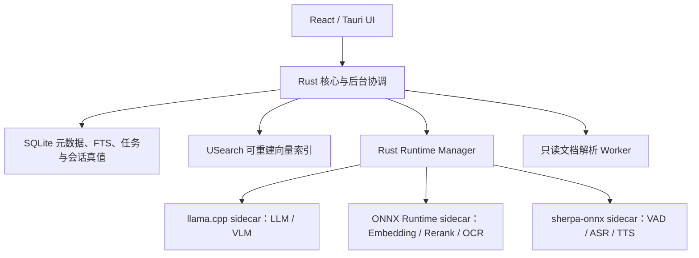

# 翻翻 V1 产品与开发规划书

> 主宣传语：**想不起来？翻翻就知道。**
>
> 次宣传语：**想得到，搜得到，翻翻知道。**

本文件是翻翻 V1 的唯一产品需求源。真实实现状态、运行证据和未完成项维护在[V1 方案逐条审查清单](V1-方案逐条审查清单.md)。不恢复用户旅程目录，不用旧安装包、历史测试数量或按钮外观代替真实功能证据。

## 1. 产品身份与安全边界

- 中文名：翻翻；英文名：FanFan；预发布版本：`0.2.0`。
- Windows 应用标识：`com.fanfan.desktop`；npm、Rust、Worker、协议、环境变量、数据目录、日志和诊断包统一使用 FanFan 身份。
- 新应用不读取、不迁移旧应用数据。旧数据不自动删除，只能在用户单独确认后清理。
- 程序图形标志和“翻翻”字标以用户提供的品牌图为唯一视觉母版。正式资产必须从原图做确定性裁剪、去除近白背景和尺寸缩放，不得用二次生成图替代或重绘品牌形状。
- 源文件始终只读；未经选择的目录不得扫描；导出必须显式触发、只新建且禁止覆盖。
- 模型、索引、提问、回答、语音和文档处理完全本地，无遥测、无云端推理。
- 日志不得记录正文、问题、答案、音频或敏感绝对路径。

## 2. 当前工程快照

以下状态只说明代码现状，不代表用户体验或最终发布已经验收。

| 范围 | 当前状态 | 仍缺少的证据 |
|---|---|---|
| 品牌当前树 | 中文/英文名、技术包名、应用标识、Worker 名、主题色和主要界面资产已经切换；品牌图来自用户原图裁剪 | 16/20/24/32px视觉确认、当前树与构建产物零残留扫描、用户体验确认 |
| Git 历史 | 远端已指向`git@github.com:Chatbot-zhou/FanFan.git`，当前工作在`codex/feat-fanfan-runtime` | 离线 bundle、全历史重写、受保护强推和全新克隆验证均未执行；必须等最终测试通过 |
| Runtime Manager | Rust 控制面、优先队列、资源租约、内存/显存门槛、单重任务限制、运行状态和取消基础已经接入主要任务 | Windows Job Object、所有子进程实例注册、真实崩溃回收、长稳和8GB资源矩阵仍未完成 |
| LLM/VLM | llama.cpp 隐藏 sidecar、真实设备探测、CUDA/Vulkan/CPU选择和线程预算已有基础 | 真实模型矩阵、GPU失败注入、空闲300秒完整卸载与指标闭环待验收 |
| Embedding/Rerank | ONNX Session 从逐请求创建改为最多两个会话的复用缓存，关闭空闲自旋并在60秒后卸载 | 独立 ONNX sidecar 和全局共享线程池仍未完成；真实模型延迟/内存测试待验收 |
| ASR/VAD | sherpa-onnx Paraformer、Silero VAD、显式麦克风录音、静音裁剪和识别后确认发送链路已接入 | 真实模型下载、自检、中文/中英混合语料、麦克风权限和设备矩阵待验收 |
| TTS | sherpa-onnx VITS、已验证回答显式朗读、暂停/继续/停止和本地临时音频已接入 | 真实音色、长回答、停止时延、缓存清理和资源竞争待验收 |
| OCR | PP-OCRv5检测、方向、识别和词典已组成完整包；RapidOCR真实最小推理、Windows回退、尝试链持久化和安全日志已接入 | 受控中文真值集、扫描PDF、内嵌图、复杂版面和PP-Structure/VLM增强待验收 |
| 数据与RAG | SQLite schema v21、分层覆盖率、扫描检查点、FTS、USearch世代、块级RRF/MMR、多轮会话和结构化严格引用已实现 | 当前2.71GB资料的完整处理尚未跑完；隐藏集质量分、50万文件/500万块及全部P0/P1/P2体验仍未最终验证 |
| 下载与模型仓库 | 下载任务语义、独立仓库和校验迁移已实现；当前Generation、Embedding、OCR、ASR共11个必需文件已逐个校验大小与SHA-256，11/11一致 | VLM、Rerank、TTS尚未安装；跨源断点、进程中取消和重置前后长期哈希仍待体验验证 |

本轮已执行的是必要开发检查点：OCR定向 Worker 测试、模型仓库/重置/Schema定向 Rust 测试、`cargo check -p fanfan-desktop --locked`、TypeScript类型检查、下载界面定向 Vitest 和公共契约检查。Clippy、全工作区、完整Worker/Vitest、压力、真实模型、安装包和安装烟测仍按约定延后。

## 3. 产品能力

翻翻在用户明确授权的本地资料中建立一个全局物理知识库，通过目录、知识空间、手动集合、规则集合和 AI 集合提供逻辑范围，不重复保存同一文件。

V1包括：

1. 文件夹或整盘授权、增量扫描、可恢复解析和索引；
2. 文档、代码、图片、扫描页和文档内图片的结构化处理；
3. 文件名、FTS、Embedding、RRF、MMR和可选Rerank组成的混合检索；
4. 只依据当前授权原文与图片证据回答的本地多模态RAG；
5. 手动集合、可视化关键词规则、AI虚拟分类建议和资料关系；
6. 本地语音输入、已验证答案朗读，以及第二阶段显式音视频转写；
7. 收件箱、预览、日志、维护、诊断和安全导出。

## 4. 总体架构

目标形态要求“控制面统一、推理后端隔离”。解析 Worker 不再长期承担所有模型生命周期；Runtime Manager 只调度稳定契约和资源租约，不共享隐式可变状态。

### 4.1 运行后端与生命周期

| 能力 | 后端 | 生命周期目标 |
|---|---|---|
| LLM、VLM | `llama.cpp`隐藏sidecar | 同时最多一个重模型；空闲300秒休眠，继续空闲后退出 |
| Embedding、Rerank | ONNX Runtime sidecar | 最多缓存两个Session；空闲60秒卸载；关闭空闲自旋 |
| OCR | RapidOCR + ONNX Runtime | 基础OCR单Session；空闲60秒卸载；复杂OCR按需启动 |
| VAD、ASR、TTS | `sherpa-onnx`sidecar | 录音/播放时加载；空闲60秒卸载 |
| 文档解析 | 独立解析Worker | 只处理格式解析、缓存与只读转换，不持有重模型 |

当前代码已经具备统一控制面和会话缓存，但 ONNX、语音与OCR仍运行在隔离的 Worker 客户端中，尚未拆为最终三个独立可执行 sidecar；这是后续 Runtime 重构的明确任务，不得标为已经完成。

### 4.2 调度与资源预算

优先级固定为：

1. 取消、窗口消息和预览；
2. 用户录音、问答、朗读和深度图片分析；
3. 搜索、交互Embedding和Rerank；
4. 增量索引；
5. OCR、图片理解、AI集合和维护。

- 同时只允许一个LLM、VLM或复杂OCR重任务；问答不得与后台图片理解抢占资源。
- CPU前台最多`min(4, 物理核心数的一半)`线程，后台默认1个核心、最多2线程。
- 系统内存保留20%或2GB，GPU显存保留15%或512MB；低于门槛时暂停新后台推理。
- 推理设备总策略：**资源满足时优先使用GPU**——运行时探测到可用GPU且显存余量≥模型需求+保留额度时，一律优先GPU推理；无GPU或显存不足时才回退CPU。设备探测结果写入运行时检查点，作为模型推荐、默认启用与状态中心展示的统一依据。
- NVIDIA优先CUDA，AMD/Intel优先Vulkan；必须以运行时实际设备清单和最小推理为准。GPU失败只回退当前任务，不破坏已安装模型。
- 子进程最终统一进入Windows Job Object，使用低优先级、应用关闭级联回收、超时、一次受控重启和心跳。
- 标题栏状态中心负责全部后台任务和下载；“翻翻当前状态”只紧凑展示隐私、授权位置、检索覆盖、索引数量、实际推理后端/设备和当前模型，不显示内部资源模式名。

## 5. 授权、扫描与知识库

- 首次必须由用户选择一个或多个文件夹、整个本地磁盘或“暂不添加”；确认前零扫描。
- 整盘授权二次确认，并硬排除Windows、Program Files、ProgramData、AppData、凭据、应用自身数据、系统卷、回收站、重解析点和云占位符。
- SQLite保存文件、修订、结构节点、内容块、图片、媒体转写、FTS、任务、会话、集合、关系、模型、运行时检查点和索引世代。
- USearch保存可替换、可重建的ANN索引；Embedding切换时旧索引继续服务，新索引验证后原子切换。
- 默认软配额为目标盘10%，下限10GB、上限50GB；前端不提供手工配额输入。
- 扫描、解析、OCR、Embedding和图片理解按小批次提交检查点，可暂停、取消和跨启动恢复；交互读取和写入优先。

## 6. 内容处理

### 6.1 文本与代码

- 标题、段落、表格、工作表、幻灯片和代码符号结构切分；目标384 tokens、最大480、重叠64。
- PDF、现代Office、文本、表格和代码使用格式专用解析器；旧Office只转换应用缓存临时副本。
- EXE、DLL、MSI只记录安全元数据，永不执行；ZIP默认只索引中央目录清单。
- 每个块保留文件、当前修订、节点、语言和精确`SourceLocator`。

### 6.2 图片与OCR

- 独立图片、PDF/PPT/Word内嵌图片、图表和扫描页均形成只读`ImageAsset`。
- 默认OCR为PP-OCRv5移动版：检测、方向分类、识别与词典必须全部校验后才激活。
- OCR输出包含文本、polygon、bbox、置信度、引擎和模型版本；扫描PDF页面先渲染到应用临时缓存，再识别。
- PP-OCRv5执行失败、没有有效文本、缺少置信度或低于配置阈值时，明确记录原因并使用Windows OCR兼容路径，绝不能静默伪装成PaddleOCR结果。
- 每次OCR持久化尝试链，包含引擎、模型版本、阶段状态、平均置信度、回退原因、耗时和安全错误码；文件预览、收件箱失败详情与日志可解释“PP-OCRv5失败 → Windows OCR完成”，但不得记录正文或敏感绝对路径。
- 表格、多栏、公式或低置信度页面进入可选PP-Structure/VLM增强；资源不足时保留基础结果，不阻塞其余索引。
- 所有处理前后抽样源文件哈希必须一致。

### 6.3 语音与媒体

第一阶段为问资料语音：

- 只有用户点击麦克风后才录音，界面持续显示录音状态；不允许后台静默录音。
- Silero VAD作为ASR预设内部组件，裁剪静音后交给Paraformer；识别文本先回填输入框，用户确认后才发送。
- 只有已通过引用校验的答案显示朗读按钮；支持暂停、继续、停止、语速和音色，默认不自动播放。
- 临时录音和合成音频只进入受控内存/缓存，完成、停止或超时后清除，不写入日志或知识库。

第二阶段为显式媒体转写：

- 音视频默认仍只记录元数据；用户必须对目录或单文件明确启用转写。
- Windows优先使用Media Foundation只读解码音轨；不支持的编码只保留元数据和原因。
- 转写结果保存为带时间范围、模型版本、置信度和来源修订的`TranscriptSegment`，再进入FTS和Embedding。
- V1只理解视频音轨，不分析整段视频帧，不做说话人分离。

## 7. 模型系统

模型角色包括：`generation`、`embedding`、`vision`、可选`reranker`、`ocr`、`asr`和`tts`；VAD随ASR预设管理，不单独暴露难懂的用户卡片。

- 推荐组合仍是一键默认入口，高级用户可逐角色更换、停用或导入兼容本地模型。
- 每个目录项必须展示方向、局限、大小、内存/显存、CPU速度、许可证、设备结论和推荐原因。
- 模型推荐必须结合用户实际设备（GPU型号、驱动可用性、显存余量）给出设备结论：有可用GPU时优先推荐GPU推理路径（小显存GPU同样可承载Embedding、Rerank、OCR等轻量模型），无GPU或显存不足才推荐CPU路径；同目录项按设备给出两套预设与性能预期，默认启用顺序遵循“GPU优先、CPU兜底”。
- 远程模型必须锁定仓库、修订、文件、大小与SHA-256；不开放任意远程代码。
- 下载任务持久记录阶段、组件、字节、速度、ETA、错误和来源，使用稳定`job_id`；运行中可暂停/取消、暂停后只能继续、失败后才能重试或切换来源，取消后立即移除任务且迟到事件不得复活。
- 同一任务切换Hugging Face/魔搭社区时不新建卡片；不同来源的断点目录隔离，切回后可续传，只有取消或显式移除任务才清理该任务的未完成文件。
- 已安装模型独立保存在`%LOCALAPPDATA%\FanFan\ModelStore\v1`，注册表和下载任务也随仓库保存。数据库重置、索引重建、缓存/日志清理、开发更新都不得删除这里的模型；只有模型管理页经二次确认的“删除模型文件”可以删除。
- 旧应用内模型首次迁移时逐文件校验大小和SHA-256，校验通过后原子启用新仓库；新仓库完成检查前保留旧目录副本。
- 下载完成不等于启用；格式、真实加载、最小推理和角色自检全部通过后才原子激活。
- Embedding、Rerank、OCR、ASR和TTS会话必须复用并可观察，禁止每次请求重新建立物理核规模线程池。

## 8. 严格本地多模态RAG

问资料是本地知识库专用多轮对话，不提供脱离资料的普通聊天。

1. 后端读取真实会话历史理解追问，但历史不能充当事实证据；
2. 在授权范围执行文件名、FTS和Embedding召回；
3. 使用RRF、修订去重、MMR和可选Rerank；
4. 对最终图片候选按当前问题重新理解或使用已经验证的入库摘要；
5. 生成模型只能依据证据组织Markdown答案；
6. 每个事实段落、列表项和表格事实都校验引用编号、权限、当前修订和原文；
7. 生成模型、Embedding或当前范围向量不可用时阻止回答并返回缺失组件、失败阶段和错误码；检索内容不得直接作为助手回答；
8. 引用结构允许一次修复，仍失败时保存失败消息并提供重试，不展示未验证生成内容，也不返回原文摘录冒充回答；
9. 没有有效证据时可以明确拒答；有答案时关键词加粗，原文同步高亮，图片显示缩略图、文件、页码/幻灯片/bbox并可定位。

## 9. 集合与资料关系

- 手动集合、关键词规则集合和AI集合都只存在于应用内，不改变源文件位置。
- 规则支持文件名、正文、类型、路径、时间、大小、AND/OR和排除。
- AI使用文档Embedding、正文、实体、时间线、图片语义和已有关系增量生成候选组，不做全量两两比较。
- 建议名称来自成员共同主题、文档类型和用途，禁止直接复制单个文件名或使用“相关资料”等空泛名称。
- 建议包含成员、置信度和逐成员理由；可预览、编辑、确认、拒绝和人工排除。
- 关系覆盖完全重复、版本候选、同主题/同用途、包含/摘要/派生方向，并支持确认和拒绝。

## 10. 品牌主题与交互

- `system`默认跟随Windows；浅色映射白天渐变，深色映射夜晚暗黑。
- 白天主题使用品牌图中的高饱和蓝、紫、粉渐变与深蓝紫正文；夜晚主题为黑底白字，交互、引用、进度和高亮继续使用品牌渐变。
- 所有散落硬编码色迁移为语义变量；欢迎页、标题栏、导航、弹窗、预览、问答、模型下载和空状态必须一致。
- 支持Windows减少动态效果；滚动条按交互出现并淡出。
- 应用内不显示`full/balanced/core`等内部调度名称，只显示可理解的状态和恢复动作。

## 11. 真实资料评测与优化闭环

当前评测基线使用两个已授权位置，不复制资料正文进仓库。最近一次恢复证据为：授权资料登记1655项，其中新增目录1649项已完成扫描收口；先前最后149项因约1.5秒SQLite锁等待导致整批回滚的问题，已改为50项小批次、保存点隔离、有限退避和扫描检查点续跑。历史`pending`、解析、OCR与向量积压仍需由真实评测运行重新统计，旧索引块的100%不得代表全库覆盖率。

本地开发评测器必须：

- 用SQLite在线备份生成DPAPI加密快照，保存在当前用户的`%LOCALAPPDATA%\FanFan\Evaluation\v1`，普通日志不记录正文、问题、答案、音频或绝对路径；
- 按文档家族划分调优、开发和隐藏集，防止同一文件不同块跨集合泄漏；
- 覆盖60条搜索、48个RAG回合、60对关系、12个集合主题簇、20张OCR图片、20段ASR音频和10段TTS文本；
- 复用应用实际的块级`HybridRetriever`、严格RAG、关系、集合和Worker链路，不另写一套“只为跑分”的检索实现；
- 在评测前后计算源文件清单与模型载荷清单哈希，任何源文件变化、越权读取、模型假就绪、永久运行任务、索引键不一致、未验证生成内容或日志泄密都直接判定失败；
- 先记录基线，再按识别/切分、召回、融合/MMR、Rerank、证据预算和结构化生成逐组优化，每组最多三轮；只有开发集提高、隐藏集不下降且硬门禁继续通过才接受参数。

百分制权重为：扫描/解析/索引20，搜索20，严格RAG30，关系/集合10，OCR/ASR/TTS10，Runtime/恢复/日志/性能10。隐藏集综合达到85分才停止调参；目标门槛包括Search Recall@10不低于0.90、MRR/nDCG@10不低于0.85，事实句引用覆盖与越权拒绝及无证据拒答均为100%，RAG事实正确性不低于0.85。真实评测未运行完成前不得发布新的综合分数。

## 12. 公共契约与数据库

当前数据库版本使用Schema v21；v19保存媒体转写与运行时状态，v20新增OCR尝试链，v21新增可恢复处理尝试、内容处置分类和扫描检查点。迁移号只前进，不倒退或复用。

核心契约包括：

- `AiRuntimeSnapshot`、`RuntimeInstanceState`、`RuntimeResourceBudget`；
- `RuntimeTask`、`RuntimeLease`、`RuntimeOperationHandle`；
- `RuntimeBackendPackage`和模型/后端兼容矩阵；
- `SpeechRecognitionSession`、`SpeechSynthesisSession`；
- `TranscriptSegment`、`MediaTranscript`；
- `ModelDownloadRemoval`、`ModelStoreStatus`和带当前来源的下载事件；
- `ProcessingCoverageSnapshot`、`FileProcessingDisposition`、`ProcessingAttempt`和`ScanCheckpoint`；
- `ModelPackageManifest`、块级`RetrievalCandidate`、`RetrievalTrace`和`GroundedAnswerDraft`；
- 本地开发专用且不经过公共Tauri正文接口的`EvaluationRun`与`EvaluationScorecard`；
- 包含polygon、bbox、置信度、模型版本、引擎和尝试链的OCR结果；
- `runtime:state`、`runtime:task`、`speech:partial`、`speech:final`、`tts:chunk`、`ocr:progress`事件。

Schema v19新增媒体转写、运行任务检查点和运行实例状态表；Schema v20新增OCR尝试记录表；Schema v21新增处理尝试、处置分类、扫描成员与检查点。长任务必须声明输入、输出、前后置条件、超时、重试、幂等键、检查点和结构化错误。

## 13. 实施顺序

1. 完成当前树品牌切换、原图资产、小尺寸视觉和零残留检查；
2. 完成Runtime Manager控制面、资源租约、真实状态和主要任务接入；
3. 完成独立模型仓库、稳定多任务下载、严格RAG以及可观察PP-OCRv5/Windows回退链；
4. 完成ONNX Session复用、ASR/VAD和TTS基础链路；
5. 拆分最终ONNX/sherpa/OCR sidecar，接入Job Object、心跳、崩溃回收和空闲卸载；
6. 完成语音体验、复杂OCR增强和第二阶段显式媒体转写；
7. 跑通当前2.71GB授权资料的扫描、解析、OCR、Embedding、USearch、搜索、RAG、关系、集合与语音评测，按开发集/隐藏集规则优化；
8. 复验既有P0/P1/P2、日志、全主题与资源争用体验；
9. 用户体验验收通过后执行完整测试、安装包和安装烟测；
10. 最终测试通过后创建项目外Git bundle，重写全部可达历史，使用`--force-with-lease`推送分支/标签，再从新仓库全新克隆验证。

## 14. 验收门禁

体验版本交付前只运行必要检查点；最终测试必须等用户明确回复“验收通过，可以做最终测试”。

最终门禁包括：

- Rust fmt/Clippy/workspace、Worker、TypeScript、Vitest、Vite、契约和中文语料全量通过；
- 8GB CPU下启动、扫描、Embedding、OCR、语音和问答持续响应；
- 50万文件/500万块的SQLite、FTS、USearch、分页、恢复和索引切换；
- 真实模型下载、断点、校验、自检、资源压力、崩溃回收、取消和空闲卸载；
- 中文ASR、VAD端点、TTS停止、PP-OCRv5、复杂文档增强和源文件哈希零变化；
- 多轮RAG、跨文件、图片、无证据拒答、越权引用和引用覆盖率门禁；
- 当前资料的加密评测快照、消融报告、隐藏集综合分与失败样本分类；综合分不足85或任一安全硬门禁失败均不得通过；
- NSIS、PE GUI子系统、普通双击、无控制台、单实例和安装/卸载烟测；
- 当前树、全部可达Git历史和新构建产物的旧品牌字符串、文件名和图标零残留。

代码签名、独立干净Windows 10/11虚拟机、杀软、多GPU和可移动设备矩阵继续作为正式发布门禁，不在本地体验阶段宣称完成。

## 15. 暂不纳入V1

云同步、NAS持续监听、移动端、插件、任意Agent、说话人分离和整段视频画面理解不纳入本轮。复杂媒体能力不得拖慢授权、索引、搜索、预览和严格RAG主链路。
