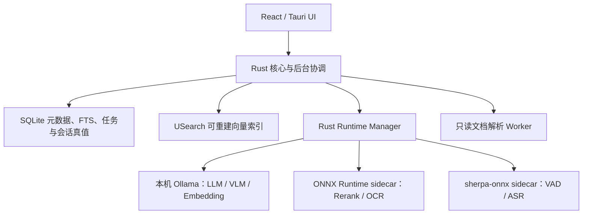

# 翻翻 V1 产品与开发规划书

> 主宣传语：**想不起来？翻翻就知道。**
>
> 次宣传语：**想得到，搜得到，翻翻知道。**

本文件是翻翻 V1 的唯一产品需求源。真实实现状态、运行证据和未完成项维护在[方案逐条审查清单](方案逐条审查清单.md)。不恢复用户旅程目录，不用旧安装包、历史测试数量或按钮外观代替真实功能证据。

## 1. 产品身份与安全边界

- 中文名：翻翻；英文名：FanFan；预发布版本：`0.2.0`。
- Windows 应用标识：`com.fanfan.desktop`；npm、Rust、Worker、协议、环境变量、数据目录、日志和诊断包统一使用 FanFan 身份。
- 新应用不读取、不迁移旧应用数据。旧数据不自动删除，只能在用户单独确认后清理。
- 程序图形标志和“翻翻”字标以用户提供的品牌图为唯一视觉母版。正式资产必须从原图做确定性裁剪、去除近白背景和尺寸缩放，不得用二次生成图替代或重绘品牌形状。
- 源文件始终只读；未经选择的目录不得扫描；导出必须显式触发、只新建且禁止覆盖。
- 模型、索引、提问、回答、语音和文档处理完全本地，无遥测、无云端推理。
- 正式产品不依赖账号、遥测、远程配置、许可证或自建后端；维护者为个人，不以常驻服务器作为任何用户功能的前置条件。
- 源码计划公开到 GitHub；Windows 安装包与静态更新资产计划放在 Gitee；rerank/OCR/ASR 等文件模型计划放在已注册的 FanFan 魔搭组织；微信公众号只发布公告，不承载产品运行链路。
- 官方 Preset 的 generation/embedding 由本机 Ollama 按 tag 拉取和托管，FanFan 不保存其远端文件与 SHA-256；rerank/OCR/ASR 仍以 ModelScope 为唯一下载源并锁定仓库、修订、文件、大小与 SHA-256；不开放任意远程代码。
- 开发、测试与测评产物默认落在翻翻工作区（`DATA\FanFanData`、`DATA\FanFanModelStore`、`DATA\FanFanEvaluation`）；评测根目录与 RAGAS 输出目录固定指向 `DATA\FanFanEvaluation`（详见 11.1），不得回落系统盘。
- 正式发布版的应用数据、日志与非 Ollama 文件模型默认存放在软件安装目录下（`<安装目录>\app-data`、`<安装目录>\model-store`）；从旧版本升级时复用迁移管线搬迁原 AppData 存量。仅当安装目录不可写（典型是 `C:\Program Files`）时退回系统 AppData 并记录 warning；debug 构建默认不启用安装盘存储。
- RAGAS 判卷不依赖任何云端裁判 API：统一走**离线 Codex 裁判**——由无联网能力的本地执行体（当前任务的智能体）读取准备工作子集并逐条评分，不配置 DeepSeek 等云端评分地址，私有片段不出机（详见 11.2/11.3）。
- 日志不得记录正文、问题、答案、音频或敏感绝对路径。

## 2. 当前工程快照

以下状态只说明代码现状，不代表用户体验或最终发布已经验收。

| 范围 | 当前状态 | 仍缺少的证据 |
|---|---|---|
| 品牌当前树 | 中文/英文名、技术包名、应用标识、Worker 名、主题色和主要界面资产已经切换；品牌图来自用户原图裁剪 | 16/20/24/32px视觉确认、当前树与构建产物零残留扫描、用户体验确认 |
| Git 历史 | 远端为 SSH `git@github.com:Chatbot-zhou/FanFan.git`；2026-08-22 已 fetch，`main` 快进到 `origin/main` 的 `a429582`。4 个本地开发分支和 2 个远端开发分支均已包含在该提交中；现有未提交源码改动已无冲突恢复到最新 `main` | 本轮未提交、未推送、未删分支；离线 bundle、全历史重写、受保护强推和全新克隆验证仍等待最终测试 |
| Runtime Manager | Rust 控制面、优先队列、资源租约、内存/显存门槛、单重任务限制、运行状态和取消基础已接入主要任务；ONNX/OCR/speech 三个独立 sidecar 已接入 Windows Job Object、进程级心跳、内存观测与空闲回收 | 8GB资源矩阵、真实崩溃注入和长稳仍未完成 |
| LLM/VLM | 主运行路径已改为只连接本机 `127.0.0.1:11434` 的 Ollama `/api/chat`；四档预设使用 `qwen3.5:0.8b/2b/4b/9b`，具备安装/运行三态、后台启动、停止、流式生成、取消、`/api/tags` 就绪登记与 `/api/ps` 占用观测 | 本机最小探针已通过（`qwen3.5:2b` chat 返回有效结果，`qwen3-embedding:0.6b` embed 返回 1024 维，`/api/ps` 可观测运行模型）；完整应用 E2E、pull/cancel/start/stop、异常恢复和安装态仍未验收；部分评测示例、前端/核心兼容枚举和旧 GGUF/llama.cpp 错误码文案仍有双轨残留；应用未证明可强制执行 300 秒模型卸载 |
| Embedding/Rerank | 主预设 Embedding 由本机 Ollama `/api/embed` 提供（`qwen3-embedding:0.6b`，1024 维）；Rerank 仍由 ONNX sidecar 提供，旧 ONNX Embedding 代码仅作兼容残留 | Ollama Embedding 的驻留与卸载由服务控制，尚未证明应用级 300 秒回收；需做索引换代、大库冷启动、非量化 Rerank GPU 收益和长稳验证 |
| ASR/VAD | sherpa-onnx 1.13.4 已打包进独立 speech sidecar（fanfan-worker.exe）；ASR 默认 SenseVoice-Small（sensevoice-small，ModelScope 单源锁定），Paraformer+tokens+Silero VAD 保留兼容；self_test 全过；显式录音、静音裁剪和识别后确认发送链路已接入 | 应用内真实录音→识别→回填链路待重验；中文/中英混合语料评测待验收 |
| OCR/图片理解 | PP-OCRv5、Windows回退与尝试链已接入；Schema v34把独立图、扫描页和内嵌图统一送入OCR，只有失败/无文本/置信不足/复杂视觉才进入本地VLM，OCR/VLM结果均可检索并返回原图 | 受控中文真值集、真实扫描PDF/Office内嵌图、复杂图表路由误判率与断电恢复待验收 |
| 数据与RAG | SQLite schema v34、分层覆盖率、扫描检查点、FTS、USearch世代、块级RRF/MMR、多轮会话、结构化严格引用与 `image_asset_id` 已实现；新增确定性 Query Planner 快路径，以及文档级元数据/语义并行召回和 RRF 融合 | 新路径当前仅有单元测试证据；需重跑真实资料覆盖、Recall/MRR/nDCG、隐藏集质量分、50万文件/500万块及全部P0/P1/P2体验 |
| 下载与模型仓库 | generation/embedding 经 Ollama `pull`（tag）拉取且不进入 FanFan 文件模型仓库；支持进度与取消，不支持暂停/继续或切换来源。rerank/OCR/ASR 仍经 ModelScope 文件下载并校验 SHA-256；启动/选档时会同步已驻留 Ollama 模型 | 真实拉取、取消后清理、断电恢复、非 Ollama 断点和重置前后长期哈希仍待体验验证 |
| 存储位置 | 正式发布版数据/日志在 `<安装目录>\app-data`、模型仓库在 `<安装目录>\model-store`，从旧 C 盘 AppData 自动迁移；仅安装目录不可写（Program Files 等保护目录）才回退 AppData 并告警；代码侧 debug 构建默认不启用安装盘存储以免污染源码目录，可用 `FANFAN_ENABLE_INSTALL_STORAGE=1` 显式开启 | 发布安装包实机验证默认落盘位置与自动迁移；受保护目录回退路径待验证 |
| 可观测性基础设施 | `operation_traces`/`node_traces` 表（v32）已上线，四条核心链路（搜索/问答/集合/关系）已接入 OperationTrace + TraceNode 持久化；线程本地存储自动关联节点与操作 | 节点追踪在实际使用中的性能与存储开销待观测 |
| 评测闭环核心 | 28类错误分类、Evidence-first 数据集、执行器、Failure Analysis 与 DEV/HOLDOUT 划分已实现；最后一次记录的 DEV baseline 是 2026-08-20 的 `01a01f3b...`，50 例通过确定性硬门禁 | 该 baseline 早于当前 Ollama/Query Planner/召回改动，不能作为当前树验收；五指标离线判卷、失败分析、当前树重跑和 HOLDOUT 均未完成 |
| 编排器与性能优化 | `evaluation_optimize.rs`、RAGAS `prepare` / `import-codex-judge` 已有历史跑通证据；本轮 all-targets 可编译，`EVALUATION_DUMP_FAILED`、`EVALUATION_OLLAMA_UNAVAILABLE` 已补入公开错误码契约 | 仍需用当前 Ollama / Query Planner / 文档级召回链路重跑闭环 |
| 语音评测 | ASR 环境落地完成（任务3），模型已装、自检全过 | 20段ASR受控语料的真实评测尚未纳入闭环 |

2026-08-22 当前树检查：`cargo fmt --all --check` 通过；公开契约检查通过（catalog=643, emitted=514）；`cargo check --workspace --all-targets --locked` 通过；`cargo test -p fanfan-core --locked` 为 385 通过/2 忽略，`cargo test -p fanfan-desktop --locked` 为 36 通过；TypeScript `tsc -b`、Vitest 13 文件/32 项、Vite 生产构建（5165 模块）通过。本机 Ollama 已安装并运行，已有 `qwen3.5:2b` 与 `qwen3-embedding:0.6b`；`/api/embed` 返回 1024 维向量，`/api/chat` 最小问答返回有效结果，`/api/ps` 可读。Worker、RAGAS、Clippy、Ollama pull/cancel/start/stop、压力、安装包和安装烟测本轮未运行。

## 3. 产品能力

翻翻在用户明确授权的本地资料中建立一个全局物理知识库，通过目录、知识空间、手动集合、规则集合和 AI 集合提供逻辑范围，不重复保存同一文件。

V1包括：

1. 文件夹或整盘授权、增量扫描、可恢复解析和索引；
2. 文档、代码、图片、扫描页和文档内图片的结构化处理；
3. 文件名、FTS、Embedding、RRF、MMR和可选Rerank组成的混合检索；
4. 只依据当前授权原文与图片证据回答的本地多模态RAG；
5. 手动集合、可视化关键词规则、AI虚拟分类建议和资料关系；
6. 本地语音输入，以及第二阶段显式音视频转写；
7. 收件箱、预览、日志、维护、诊断和安全导出。

## 4. 总体架构

目标形态要求“控制面统一、推理后端隔离”。解析 Worker 不再长期承担所有模型生命周期；Runtime Manager 只调度稳定契约和资源租约，不共享隐式可变状态。

### 4.1 运行后端与生命周期

| 能力 | 后端 | 生命周期目标 |
|---|---|---|
| LLM、VLM | 本机 Ollama（`/api/chat`） | Runtime Manager 约束前台重任务；GPU/CPU 和模型驻留由 Ollama 内建调度。当前只观测 `/api/ps`，尚未实现或验证应用强制的 300 秒卸载 |
| Embedding | 本机 Ollama（`/api/embed`，`qwen3-embedding:0.6b`，1024 维） | FanFan 复用本机服务并缓存查询结果；物理 Session 与模型驻留由 Ollama 管理，需实测冷启动与回收 |
| Rerank | ONNX Runtime sidecar | 最多缓存两个Session；空闲回收与 parse 同取300秒驻留 |
| OCR | RapidOCR + ONNX Runtime | 基础OCR单Session；模型较大且低频，空闲60秒卸载；复杂OCR按需启动 |
| VAD、ASR | `sherpa-onnx`sidecar | 录音时加载；模型较大且低频，空闲60秒卸载 |
| 文档解析 | 独立解析Worker | 只处理格式解析、缓存与只读转换，不持有重模型 |

ONNX、OCR、speech 已拆为三个独立 `fanfan-worker.exe --role onnx|ocr|speech` sidecar 并接入 Windows Job Object、进程级心跳、内存观测与空闲回收。当前主预设的 ONNX 角色是 Rerank；ONNX Embedding 仅保留兼容代码，不应再作为主架构描述。

### 4.2 调度与资源预算

优先级固定为：

1. 取消、窗口消息和预览；
2. 用户录音、问答和深度图片分析；
3. 搜索、交互Embedding和Rerank；
4. 增量索引；
5. OCR、图片理解、AI集合和维护。

- 同时只允许一个LLM、VLM或复杂OCR重任务；问答不得与后台图片理解抢占资源。
- CPU前台最多`min(4, 物理核心数的一半)`线程，后台默认1个核心、最多2线程。
- 系统内存保留20%或2GB，GPU显存保留15%或512MB；低于门槛时暂停新后台推理。
- 推理设备总策略：**资源和模型均适合时优先使用GPU**——运行时探测到可用GPU、显存余量≥模型需求+保留额度，且模型未命中实测性能保护时，优先GPU推理；无GPU、显存不足或目标模型CPU实测更快时走CPU。设备、执行Provider与回退原因写入运行时检查点。
- NVIDIA优先CUDA，AMD/Intel优先Vulkan；必须以运行时实际设备清单和最小推理为准。GPU Session创建或推理失败只重试当前任务的CPU路径，不破坏模型、索引或已验证结果；当前`model_quantized.onnx`可由`FANFAN_WORKER_PROVIDERS`显式覆盖，仅用于诊断和高级用户测试。
- 子进程统一进入Windows Job Object，使用低优先级、应用关闭级联回收、超时、一次受控重启和进程级心跳（spawn 后 30 秒冷启动宽限、稳态 8 秒失联判定）。
- 标题栏状态中心负责全部后台任务和下载；“翻翻当前状态”只紧凑展示隐私、授权位置、检索覆盖、索引数量、实际推理后端/设备和当前模型，不显示内部资源模式名。

## 5. 授权、扫描与知识库

- 首次必须由用户选择一个或多个文件夹、整个本地磁盘或“暂不添加”；确认前零扫描。
- 整盘授权二次确认，并硬排除Windows、Program Files、ProgramData、AppData、凭据、应用自身数据、系统卷、回收站、重解析点和云占位符。
- SQLite保存文件、修订、结构节点、内容块、图片、媒体转写、FTS、任务、会话、集合、关系、模型、运行时检查点和索引世代。
- USearch保存可替换、可重建的ANN索引；Embedding切换时旧索引继续服务，新索引验证后原子切换。
- 默认软配额为目标盘10%，下限10GB、上限50GB；前端不提供手工配额输入。
- 扫描、解析、OCR、Embedding和图片理解按小批次提交检查点，可暂停、取消和跨启动恢复；交互读取和写入优先。

## 6. 内容处理

### 6.1 文本与代码

- 标题、段落、表格、工作表、幻灯片和代码符号结构切分；目标384 tokens、最大480、重叠64。
- PDF、现代Office、文本、表格和代码使用格式专用解析器；旧Office只转换应用缓存临时副本。
- EXE、DLL、MSI只记录安全元数据，永不执行；ZIP默认只索引中央目录清单。
- 每个块保留文件、当前修订、节点、语言和精确`SourceLocator`。

### 6.2 图片与OCR

- 独立图片、PDF/PPT/Word内嵌图片、图表和扫描页均形成只读`ImageAsset`。
- 默认OCR为PP-OCRv5移动版：检测、方向分类、识别与词典必须全部校验后才激活。
- OCR输出包含文本、polygon、bbox、置信度、引擎和模型版本；扫描PDF页面先渲染到应用临时缓存，再识别。
- PP-OCRv5执行失败、没有有效文本、缺少置信度或低于配置阈值时，明确记录原因并使用Windows OCR兼容路径，绝不能静默伪装成PaddleOCR结果。
- 每次OCR持久化尝试链，包含引擎、模型版本、阶段状态、平均置信度、回退原因、耗时和安全错误码；文件预览、收件箱失败详情与日志可解释“PP-OCRv5失败 → Windows OCR完成”，但不得记录正文或敏感绝对路径。
- 表格、多栏、公式或低置信度页面进入可选PP-Structure/VLM增强；资源不足时保留基础结果，不阻塞其余索引。
- 所有处理前后抽样源文件哈希必须一致。

#### 6.2.1 图片 Embedding 与检索关联（开发完成 · 待真实资料体验）

数据处理（embedding）阶段对不同类型输入实施以下策略：

1. **文本数据**：直接进行 embedding，存储到向量数据库。
2. **图片数据**：内嵌图、独立图和扫描页统一进入`pending_ocr → ocr_processing`状态——
   - **高置信度普通文字图**：OCR文本直接形成带`image_asset_id`的`image_ocr`节点和Embedding块，图片状态进入`ready`；
   - **OCR失败、无文本、缺置信度、低置信度或疑似图表/复杂版面**：保留已有OCR文字作为视觉提示，进入`pending_understanding → processing`，由本地VLM生成图片总结；
   - **资源或模型暂不可用**：任务保留在持久检查点，前台活动和`core`降级期间让步，不阻塞正文索引和其他用户操作。
3. **统一落库**：OCR文本或VLM总结均形成与`image_asset_id`强关联的节点、FTS块和待Embedding块；Schema v34保存OCR引擎、置信度、路由原因、尝试次数和幂等键，升级时自动回填历史图片检索节点。
4. **检索返回**：全文与语义命中沿`document_nodes.image_asset_id`返回准确图片标识，桌面端通过只读`fanfan-image.localhost/<asset_id>`协议直接展示命中图片。

当前量化约束：

- RapidOCR平均置信度阈值为`0.45`；执行失败、无文本、缺置信度、低于阈值，以及短文本视觉图、数字密集图表或短行复杂布局均进入VLM；Windows OCR无可靠置信度时也进入VLM，不把兼容结果伪装成高置信度终态。
- 多模态结构化图片总结非空且最长`1200`字符；提交前校验当前修订、授权范围、缓存大小/SHA-256和幂等检查点。
- OCR/VLM节点、块、FTS、Embedding与`image_asset_id`在单个SQLite事务中写入；旧节点替换时同步删除旧FTS/块，避免向量与图片错绑。
- 已有定向测试覆盖“普通OCR跳过VLM”“低置信度OCR进入VLM”“VLM图片证据可问答引用”“图片文本搜索返回原图”；仍需用真实内嵌图、扫描PDF和复杂图表做准确率、耗时与断电恢复验收。

### 6.3 语音与媒体

第一阶段为问资料语音：

- 只有用户点击麦克风后才录音，界面持续显示录音状态；不允许后台静默录音。
- Silero VAD作为ASR预设内部组件，裁剪静音后交给识别；预设 ASR 默认 `sensevoice-small`，speech worker 按 `arch`（`paraformer`/`sense_voice`）参数化选择引擎，Paraformer 保留兼容；识别文本先回填输入框，用户确认后才发送。
- 临时录音只进入受控内存/缓存，完成、停止或超时后清除，不写入日志或知识库。
- 朗读（语音合成/TTS）功能已按功能评估结果整体移除（2026-08-20），本规划不再包含语音合成开发计划、资源分配与验收标准；语音输入（ASR）保留，详见 11.4。

第二阶段为显式媒体转写：

- 音视频默认仍只记录元数据；用户必须对目录或单文件明确启用转写。
- Windows优先使用Media Foundation只读解码音轨；不支持的编码只保留元数据和原因。
- 转写结果保存为带时间范围、模型版本、置信度和来源修订的`TranscriptSegment`，再进入FTS和Embedding。
- V1只理解视频音轨，不分析整段视频帧，不做说话人分离。

#### 6.3.1 ASR 模型：实现方案与剩余验收

当前 ASR 方案的实现与定位：

- **默认模型为 SenseVoice-Small**（`sensevoice-small`，ModelScope 单源 `chriscrs/sherpa-onnx-sense-voice-zh-en-ja-ko-yue-int8-2024-07-17`，大小/SHA-256 已锁定，`verification_status=verified`）；speech worker 按 `arch`（`paraformer`/`sense_voice`）参数化，默认 `sensevoice` 分支，识别基于文本、不强制依赖短窗静音裁剪。
- Paraformer 中文主模型 + tokens + Silero VAD 作为兼容备选保留（`arch=paraformer`），供按 catalog_id 推导回退，不做默认主链。
- `services/worker` 已锁定依赖 `sherpa-onnx==1.13.4` + `sherpa-onnx-core`（内置 ONNX Runtime），`fanfan-worker.exe`（PyInstaller sidecar，位于资源目录 `worker/`）已构建，`WorkerClient::from_executable` 走通；独立 speech sidecar 已接入 Windows Job Object、进程级心跳与内存观测。
- ASR 模型 `self_test_asr` 最小静音自检全部通过；大小与 SHA-256 逐文件锁定。
- 前端链路：只有点击麦克风后启用录音、16k 重采样、识别文本先回填输入框、用户确认后才发送；临时录音只在内存/受控缓存，完成/停止/超时即清除，不写日志或知识库。

剩余验收：

1. 应用内真实录音 → VAD 裁剪 → SenseVoice 识别 → 回填输入框的真实链路重验（需在当前应用实例确认）；
2. 中文/中英混合准确率与端点鲁棒性：20 段 ASR 受控语料进入真实评测隐藏集，与既有 OCR/ASR 分项合并计分。

**降级策略**：运行环境或模型未就绪时，语音按钮保持禁用或隐藏；语音能力不阻塞问资料、检索、关系/集合等主链路；环境补齐后无需改动前端契约。

## 7. 模型系统

模型角色包括：`generation`、`embedding`、`vision`、可选`reranker`、`ocr`和`asr`；VAD随ASR预设管理，不单独暴露难懂的用户卡片。

- 推荐组合仍是一键默认入口；当前 UI 可选预设与已安装组件，但 generation/embedding/vision 的本地导入入口已移除。核心层仍保留 GGUF/ONNX 导入兼容代码与测试，清理前不得宣称全树已完全去除旧路径。
- 每个目录项必须展示方向、局限、大小、内存/显存、CPU速度、许可证、设备结论和推荐原因。
- 模型推荐必须结合用户实际设备（GPU型号、驱动可用性、显存余量）和模型图类型给出设备结论：兼容且实测有收益时优先GPU，无GPU、显存不足或CPU优化量化图反而更快时推荐CPU；同目录项给出真实性能预期，不把“GPU可运行”误写成“GPU一定更快”。
- GPU版Worker仍完全本地运行且保留`CPUExecutionProvider`，不依赖项目服务器；代价是安装包需要附带CUDA/cuDNN运行库，上传Gitee前必须完成一次干净打包并记录安装包增量、首次启动和纯CPU机器烟测结果。
- ModelScope 文件模型必须锁定仓库、修订、文件、大小与 SHA-256；Ollama 模型以 tag 和本机 `/api/tags` 为就绪证据，不由 FanFan 锁定远端文件哈希；两类路径都不开放任意远程代码。
- 所有下载任务持久记录阶段、组件、字节、速度、ETA、错误和稳定 `job_id`。ModelScope 文件下载支持既有暂停/继续/失败重试与来源语义；Ollama `pull` 只支持进度和取消，明确返回“不支持暂停”，失败后重试仍使用同一 tag。
- Hugging Face/ModelScope 的切源与断点目录隔离规则只适用于文件模型；Ollama 不提供 FanFan 可控的跨源或断点目录，不得在 UI 或验收中承诺切源续传。
- 非 Ollama 文件模型保存在正式版 `<安装目录>\model-store`（debug/本地评测可使用工作区 `DATA\FanFanModelStore`）；数据库重置、索引重建、缓存/日志清理和开发更新不得删除，只有显式二次确认的“删除模型文件”可以删除。
- 旧应用内模型首次迁移时逐文件校验大小和SHA-256，校验通过后原子启用新仓库；新仓库完成检查前保留旧目录副本。
- 下载完成不等于启用；格式、真实加载、最小推理和角色自检全部通过后才原子激活。
- Ollama Embedding 复用本机服务；Rerank、OCR和ASR的 sidecar Session 必须复用并可观察，禁止每次请求重新建立物理核规模线程池。

### 7.1 ModelPreset → Runtime（已落地）

`selected_preset_id` 是真实运行入口：选择预设即持久化 `preset_id`，并经 `preset_resolver`（`RuntimeModelPlan` / `resolve_runtime_model_plan`）驱动各角色模型加载；旧 `model_role_config` / `role_configs()` 已删除。`ModelManager::apply_runtime_plan` 把各角色 active 对到「catalog_id 匹配且就绪」的本地 artifact，缺失项上报 `missing` 触发「下载源弹窗」入队下载；启动层在持有 `selected_preset_id` 时同样执行。前端 `ModelPresetPanel` 选择后刷新模型状态。

定稿四档（`ModelPresetPanel`/`browser-bridge.ts` 与后端目录项一致）：

- Generation `Qwen3.5`（0.8B / 2B / 4B / 9B Q4，本机 Ollama tag `qwen3.5:0.8b/2b/4b/9b`）；Embedding 统一 `qwen3-embedding:0.6b`（1024 维，四档一致，本机 Ollama `/api/embed`），切换 embedding 触发 `index_stale_check` 重建提示 Banner；Reranker 统一 `bge-reranker-base`（onnx sidecar）；OCR `ppocr-v6-small`（basic·smooth）与 `ppocr-v6-medium`（balanced·high）；ASR `sensevoice-small`。
- generation/embedding 经本机 Ollama `pull`（tag）拉取，无本地文件、无 sha256，就绪判定 `collect_plan_report` 对 `format=Ollama` 不再要求本地文件存在；rerank/ocr/asr 仍经 ModelScope 单源文件下载并 sha256 校验（`verification_status=verified`）。
- 启动/选档时自动探测本机 Ollama `/api/tags` 已驻留模型并登记就绪（`ollama_generation_ready` / `ollama_embedding_ready`），老用户升级后已装模型直接可用、不再反复提示下载；旧 GGUF generation artifact 自动置 `inactive`。
- Ollama 三态引导：未安装→引导安装；已装未运行→后台拉起 `ollama serve`；已运行→就绪。`OLLAMA_*` 错误码已在 `error-codes.json` 登记。
- ASR/OCR 参数化：`SpeechRecognitionRequest.arch`（`paraformer`/`sense_voice`）、`OcrRuntimeConfig.ocr_version`（`v4`/`v5`/`v6`）按 catalog_id 推导，新模型可直接替换，旧模型（Paraformer / PP-OCRv5）保持兼容。
- GPU 实测字段：`GenerationActivation.fallback_reason` / `vram_usage_bytes` 记录 Ollama 内建 GPU/CPU 调度结果。

仍待办：

- 端到端问答实机核验：在目标机（锚点 RTX 3050Ti 4GB）首次启动触发「缺失模型批量下载」后做一次真实问答「证据召回→精排→生成→引用」质检链路，验证后归档。
- 收口双轨残留：README 与 release manifest 已改为 Ollama/ASR 当前口径；`evaluate_local.rs`/`vlm_consumer.rs`、旧 llama.cpp/GGUF 错误码文案、前端/核心兼容枚举和兼容导入契约仍需逐项决定“删除或明确标注兼容”。
- 通过 `cargo fmt --all --check`，再重跑契约、Clippy、Worker/RAGAS 与真实 Ollama 拉取/取消/停止/模型驻留验证。

## 8. 严格本地多模态RAG

问资料是本地知识库专用多轮对话，不提供脱离资料的普通聊天。

1. 后端读取真实会话历史理解追问，但历史不能充当事实证据；
2. 在授权范围执行文件名、FTS和Embedding召回；
3. 使用RRF、修订去重、MMR和可选Rerank；
4. 对最终图片候选按当前问题重新理解或使用已经验证的入库摘要；
5. 生成模型只能依据证据组织Markdown答案；
6. 每个事实段落、列表项和表格事实都校验引用编号、权限、当前修订和原文；
7. 生成模型、Embedding或当前范围向量不可用时阻止回答并返回缺失组件、失败阶段和错误码；检索内容不得直接作为助手回答；
8. 引用结构允许一次修复，仍失败时保存失败消息并提供重试，不展示未验证生成内容，也不返回原文摘录冒充回答；
9. 没有有效证据时可以明确拒答；有答案时关键词加粗，原文同步高亮，图片显示缩略图、文件、页码/幻灯片/bbox并可定位。

## 9. 集合与资料关系

- 手动集合、关键词规则集合和AI集合都只存在于应用内，不改变源文件位置。
- 规则支持文件名、正文、类型、路径、时间、大小、AND/OR和排除。
- AI使用文档Embedding、正文、实体、时间线、图片语义和已有关系增量生成候选组，不做全量两两比较。
- 建议名称来自成员共同主题、文档类型和用途，禁止直接复制单个文件名或使用“相关资料”等空泛名称。
- 建议包含成员、置信度和逐成员理由；可预览、编辑、确认、拒绝和人工排除。
- 关系覆盖完全重复、版本候选、同主题/同用途、包含/摘要/派生方向，并支持确认和拒绝。

## 10. 品牌主题与交互

- `system`默认跟随Windows；浅色映射白天渐变，深色映射夜晚暗黑。
- 白天主题使用品牌图中的高饱和蓝、紫、粉渐变与深蓝紫正文；夜晚主题为黑底白字，交互、引用、进度和高亮继续使用品牌渐变。
- 所有散落硬编码色迁移为语义变量；欢迎页、标题栏、导航、弹窗、预览、问答、模型下载和空状态必须一致。
- 支持Windows减少动态效果；滚动条按交互出现并淡出。
- 应用内不显示`full/balanced/core`等内部调度名称，只显示可理解的状态和恢复动作。

## 11. 真实资料评测与优化闭环

当前评测基线使用两个已授权位置，不复制资料正文进仓库。已登记资料 1655 项，新增目录 1649 项已完成扫描收口（扫描采用 50 项小批次、保存点隔离、有限退避与检查点续跑）。解析后产生的约 3675 个 `ocr_pending` 图片资产由 VLM 消费端（`crates/core/examples/vlm_consumer.rs`：claim → 多模态补齐文字/摘要 → commit → 文件提升）全量处理；处理完成后依次执行 `--backfill-embeddings` 回填嵌入并重建活动向量代、重跑 `evaluate_local`（parse/embedding/vector_coverage ≥ 0.95 门禁），再进入消融调优。旧索引块的 100% 不得代表全库覆盖率。

本地开发评测器必须：

- 用SQLite在线备份生成DPAPI加密快照，保存在工作区`DATA\FanFanEvaluation`（见 11.1），普通日志不记录正文、问题、答案、音频或绝对路径；
- 按文档家族划分调优、开发和隐藏集，防止同一文件不同块跨集合泄漏；
- 覆盖60条搜索、48个RAG回合、60对关系、12个集合主题簇、20张OCR图片和20段ASR音频；
- 复用应用实际的块级`HybridRetriever`、严格RAG、关系、集合和Worker链路，不另写一套“只为跑分”的检索实现；
- 在评测前后计算源文件清单与模型载荷清单哈希，任何源文件变化、越权读取、模型假就绪、永久运行任务、索引键不一致、未验证生成内容或日志泄密都直接判定失败；
- 先记录基线，再按识别/切分、召回、融合/MMR、Rerank、证据预算和结构化生成逐组优化，每组最多三轮；只有开发集提高、隐藏集不下降且硬门禁继续通过才接受参数。

百分制权重为：扫描/解析/索引20，搜索20，严格RAG30，关系/集合10，OCR/ASR10，Runtime/恢复/日志/性能20（TTS 移除后其权重并入 Runtime/恢复/日志/性能，总分保持100）。隐藏集综合达到85分才停止调参；目标门槛包括Search Recall@10不低于0.90、MRR/nDCG@10不低于0.85，事实句引用覆盖与越权拒绝及无证据拒答均为100%，RAG事实正确性不低于0.85。真实评测未运行完成前不得发布新的综合分数。

### 11.1 工作区本地化与评测产物约束

评测、开发、测试与运行产物统一落在翻翻工作区，不回落到系统盘，符合“源文件只读 + 完全本地”的安全边界：

- 评测根目录默认 `DATA\FanFanEvaluation`：Rust 加密快照（`.ffeval`）、RAGAS 导出（`ragas/ragas-<run_id>.jsonl.dpapi`）、批清单（`batches/`）与 prepare 产物（`ragas/<run_id>/`）都在该目录；由 `run_ragas.ps1` 的 `-EvaluationRoot`/`-OutputRoot` 默认值实现，未显式指定时自动定向工作区。
- 模型与数据仓库位于工作区：`DATA\FanFanModelStore`、`DATA\FanFanData`；三者在仓库 `.gitignore` 内，不随提交。
- 兜底约束：`fanfan_ragas.py._default_output_root` 依据脚本位置推导工作区路径，即使直接调用工具也不会回落到系统盘 `%LOCALAPPDATA%`。
- 遵守 TRAE 沙箱等“不越界写盘”的运行环境限制，是评测能稳定在这台机器跑通的前提。

### 11.2 RAGAS 离线 Codex 裁判闭环

RAGAS 0.4.3 独立层（`eval/ragas/`）仅做本地 prepare 与离线判卷导入，判卷不依赖任何云端裁判 API：

- `prepare` 把 Rust 真实链路导出的子集校验、去敏并落盘为带预算的报告与 manifest（`judge_provider=codex`、确认短语 `SEND_PRIVATE_EVAL_CONTEXT`），明细只在当前用户可解密的工作区目录内；只展示 case/上下文/字符预算与截断数。
- 判卷由无联网能力的本地执行体（当前任务的智能体）担任：在本地解密读题，按 `ragas-five-metrics-v1` 对 Faithfulness、Answer Relevancy、Context Precision(with reference)、Context Recall、Factual Correctness 逐条打分，并给出可选失败类别；无证据/越权/拒答继续走确定性硬门禁（不把缺失指标记成 0）。
- `import-codex-judge --run-id <id> --confirm SEND_PRIVATE_EVAL_CONTEXT --input judgement.json` 导入判卷结果并写入 reports/scores，全程无外网、无云端 API、无私有片段上传；判卷用的临时明文仅在当前 Windows 用户会话内解密，不落仓库、不推远端。
- 取消第 1 节中“云端裁判”作为评测例外的说法：私有资料出机不再依赖逐次人工授权联网。

### 11.3 评测现状与优化迭代

当前数据集版本 `v2-ragas-batched`，DEV/HOLDOUT 按文件 ID 的 FNV-1a 哈希确定性划分（已冻结 DEV=444、HOLDOUT=74），每批 50 例。

- **DEV baseline**（2026-08-20）：`run_id=01a01f3b-8a06-7693-8369-9fc78d5c8a16`，DEV batch-00 共 50 例全部通过确定性硬门禁（evidence_recall 1.0、grounded_answer_rate 1.0，P50≈304ms、P95≈425ms）；RAGAS 五指标判卷与 Failure Analysis 待离线 Codex 执行。
- **当前适用性**（2026-08-22）：上述 baseline 产生于本轮 Ollama 生成/Embedding、Query Planner 快路径和文档级并行召回改动之前，只保留为历史对照，不得用来证明当前树质量；修复格式与契约门禁后必须重新生成 run_id。
- **优化节奏**：按失败类别（证据选择、文档召回、智能集合、可回答性、搜索排序）做最多三轮 DEV 优化，每轮 `pipeline(post_opt)` → 离线判卷 → 对比；只有 DEV 提高、HOLDOUT 不下降且硬门禁保持通过才接受参数。
- **接受/停止标准**：隐藏集综合达到 85 分才停止调参（见本节权重与目标门槛），否则输出明确瓶颈与证据；中止前生成 `OPTIMIZATION_HISTORY.md` 记录每轮改动与指标。

### 11.4 移除语音合成与朗读功能（2026-08-20，已落地）

根据项目实际需求与功能评估结果，语音合成（TTS）及朗读功能整体移除，仅保留语音输入（ASR）。本次移除范围与验证结论：

- **移除内容**：模型配置文件中全部语音合成模型的参数设置与引用（`ModelRole::Tts`、预设/能力/运行时配置的 `tts` 字段、catalog 中 TTS 条目）；资料系统朗读功能模块及接口（`speech_synthesize_answer` 命令、`tts:chunk` 事件、`SpeechSynthesisSession`）；speech worker 的 TTS 实现逻辑与依赖（`synthesize_speech`/`self_test_tts`/`_get_tts`）；前端朗读 UI 与播放链路；相关测试用例与示例；规划书中 TTS 开发计划、资源分配与验收标准；本地模型仓库 `registry.json` 的 TTS 条目与 `DATA\FanFanModelStore\tts\` 模型文件（经用户确认清理）。
- **保留内容**：ASR（`speech_recognize`/VAD/录音回填）不受影响，`ModelRole::Asr` 与 speech worker 的识别链路保持完整；ONNX/OCR/Rerank/Generation/Embedding/Vision 等其他功能模块不受影响。
- **验证结论**：`cargo check`（core+desktop）、`cargo test --workspace`、Worker `unittest`、前端 `tsc -b`/`vitest` 均通过，且全树检索确认无 TTS/朗读残留引用（详见审查清单第 2 节）。朗读功能已完全不可用，系统整体功能正常。

## 12. 公共契约与数据库

当前数据库版本使用Schema v34；v19保存媒体转写与运行时状态，v20新增OCR尝试链，v21新增可恢复处理尝试、内容处置分类和扫描检查点，v22新增节点追踪（node_traces），v23新增块邻居上下文索引，v24新增关系组（relation_groups），v25修正加密/损坏文件的处置分类一致性，v26-v31为后续渐进 schema 演进（模型/运行时/索引相关），v32新增链路级操作追踪（operation_traces），v33新增评测闭环持久化（evaluation_cases/evaluation_runs/evaluation_results），v34新增图片 OCR→VLM 状态机与图片检索关联（`image_asset_id` 证据关联，升级时自动回填历史图片检索节点）。迁移号只前进，不倒退或复用。

核心契约包括：

- `AiRuntimeSnapshot`、`RuntimeInstanceState`、`RuntimeResourceBudget`；
- `RuntimeTask`、`RuntimeLease`、`RuntimeOperationHandle`；
- `RuntimeBackendPackage`和模型/后端兼容矩阵；
- `SpeechRecognitionSession`；
- `TranscriptSegment`、`MediaTranscript`；
- `ModelDownloadRemoval`、`ModelStoreStatus`和带当前来源的下载事件；
- `ProcessingCoverageSnapshot`、`FileProcessingDisposition`、`ProcessingAttempt`和`ScanCheckpoint`；
- `ModelPackageManifest`、块级`RetrievalCandidate`、`RetrievalTrace`和`GroundedAnswerDraft`；
- 本地开发专用且不经过公共Tauri正文接口的`EvaluationRun`与`EvaluationScorecard`；
- 包含polygon、bbox、置信度、模型版本、引擎和尝试链的OCR结果；
- `runtime:state`、`runtime:task`、`speech:partial`、`speech:final`、`ocr:progress`事件。

Schema v19新增媒体转写、运行任务检查点和运行实例状态表；Schema v20新增OCR尝试记录表；Schema v21新增处理尝试、处置分类、扫描成员与检查点；v22-v25见上。长任务必须声明输入、输出、前后置条件、超时、重试、幂等键、检查点和结构化错误。

## 13. 实施顺序

1. ✅ 完成当前树品牌切换、原图资产、小尺寸视觉和零残留检查；
2. ✅ 完成Runtime Manager控制面、资源租约、真实状态和主要任务接入；
3. ✅ 完成独立模型仓库、稳定多任务下载、严格RAG以及可观察PP-OCRv5/Windows回退链；
4. ✅ 完成ONNX Session复用和ASR/VAD基础链路；
5. ✅ 拆分最终ONNX/sherpa/OCR sidecar，接入Job Object、心跳、崩溃回收和空闲卸载；
6. 🔄 收口 Ollama 迁移与检索重构：rustfmt、公共契约、README/release manifest 口径、本机最小 chat/embed/ps 探针已收口；继续清理或明确标注评测示例与兼容路径中的 llama.cpp/GGUF 双轨残留，完成真实 pull/cancel/start/stop、应用 E2E 问答与索引换代验证；
7. 🔄 完成语音体验、复杂OCR增强验收和第二阶段显式媒体转写（OCR不足后路由VLM的链路已落地，仍缺真实复杂样本；语音应用内链路待重验；媒体转写未开始）；
8. 🔄 跑通当前2.71GB授权资料的扫描、解析、OCR→VLM、Embedding、USearch、搜索、RAG、关系、集合与语音评测，按开发集/隐藏集规则优化（需按Schema v34重新统计队列，不能沿用旧的VLM全量消费估算）；
9. 🔄 完成四条核心链路可观测性与「测试→定位→优化→回归」评测闭环（历史 DEV baseline 只作对照；当前树须生成新 run_id 后再判卷和迭代，见 11.3）；
10. ⬜ 复验既有P0/P1/P2、日志、全主题与资源争用体验；
11. ⬜ 用户体验验收通过后执行完整测试、安装包和安装烟测；
12. ⬜ 最终测试通过后创建项目外Git bundle，重写全部可达历史，使用`--force-with-lease`推送分支/标签，再从新仓库全新克隆验证。

## 14. 验收门禁

体验版本交付前只运行必要检查点；最终测试必须等用户明确回复“验收通过，可以做最终测试”。

最终门禁包括：

- Rust fmt/Clippy/workspace、Worker、TypeScript、Vitest、Vite、契约和中文语料全量通过；
- 8GB CPU下启动、扫描、Embedding、OCR、语音和问答持续响应；
- 50万文件/500万块的SQLite、FTS、USearch、分页、恢复和索引切换；
- 真实模型下载、断点、校验、自检、资源压力、崩溃回收、取消和空闲卸载；
- 中文ASR（SenseVoice/Paraformer）、VAD端点、OCR（PP-OCRv6/v5 + Windows回退）、复杂文档增强和源文件哈希零变化；
- 多轮RAG、跨文件、图片、无证据拒答、越权引用和引用覆盖率门禁；
- 当前资料的加密评测快照、消融报告、隐藏集综合分与失败样本分类；综合分不足85或任一安全硬门禁失败均不得通过；
- NSIS、PE GUI子系统、普通双击、无控制台、单实例和安装/卸载烟测；
- 当前树、全部可达Git历史和新构建产物的旧品牌字符串、文件名和图标零残留。

代码签名、独立干净Windows 10/11虚拟机、杀软、多GPU和可移动设备矩阵继续作为正式发布门禁，不在本地体验阶段宣称完成。

## 15. 暂不纳入V1

云同步、NAS持续监听、移动端、插件、任意Agent、说话人分离和整段视频画面理解不纳入本轮。复杂媒体能力不得拖慢授权、索引、搜索、预览和严格RAG主链路。
